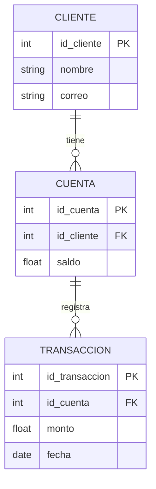

# Bases de Datos  
**Fecha:** 11/02/2026  

## Propósito del curso

El objetivo del curso es aprender a trabajar con bases de datos y ser conscientes de que forman parte de nuestra vida diaria, incluso cuando no lo notamos.

Las bases de datos están presentes en muchas actividades cotidianas. Aunque no tengamos conocimiento técnico sobre ellas, las usamos constantemente.

---

## Importancia de las bases de datos en la vida diaria

Si en algún momento has:

- Hecho una reservación en un hotel o restaurante  
- Usado un cajero electrónico  
- Realizado una llamada desde tu celular  

Entonces has utilizado una base de datos.

### Ejemplo: Cajero automático

Cuando utilizas un cajero automático:

1. Te identificas ante el banco con tu tarjeta.
2. Ingresas tu contraseña para iniciar sesión.
3. El sistema accede a tu perfil.
4. Antes de entregar el dinero solicitado, la base de datos verifica si tienes fondos suficientes.
5. Si todo es correcto, se autoriza la transacción.

Todo este proceso depende de una base de datos que almacena y consulta información en tiempo real.

---

### Ejemplo: Llamadas desde el celular

Para poder realizar una llamada:

- Debes estar registrado en una estación base.
- El sistema identifica desde dónde estás llamando.
- La red consulta bases de datos para validar tu línea y permitir la comunicación.

---

### Ejemplo: Control del tráfico

Muchas ciudades utilizan sistemas basados en bases de datos para controlar el tráfico.

Por ejemplo:

- Un sistema de semáforos puede contar la cantidad de vehículos en una vía.
- Con esa información, el sistema puede dar prioridad a ciertas rutas.
- Esto mejora la movilidad y reduce la congestión.

---

## ¿Qué es una base de datos?

Una base de datos es un conjunto organizado de información que puede ser almacenada, consultada y modificada.

### ¿Un archivo de Excel o un bloc de notas es una base de datos?

Sí.  
Un archivo de Excel o incluso un archivo de texto puede considerarse una base de datos, ya que almacena información estructurada.

Sin embargo, no necesariamente es una base de datos relacional.

---

## Base de datos relacional

Una base de datos relacional organiza la información en tablas, las cuales se relacionan entre sí mediante claves.

Cada tabla tiene:

- Campos (columnas): Definen los atributos.
- Registros (filas): Contienen los datos.
- Clave primaria (Primary Key): Identificador único.
- Clave foránea (Foreign Key): Relaciona tablas entre sí.

---

## Ejemplo de Base de Datos Relacional (Diagrama Mermaid)




# ¿Cómo se lee un modelo de base de datos relacional?

En un diagrama entidad–relación (ER), como el que se hace en Mermaid, las tablas se representan como entidades y las líneas entre ellas muestran las relaciones.

## 1. Entidades (Tablas)

Cada bloque representa una tabla.

Ejemplo:

CLIENTE  
CUENTA  
TRANSACCION  

Dentro de cada tabla aparecen:

- PK (Primary Key): Clave primaria, identifica de manera única cada registro.
- FK (Foreign Key): Clave foránea, conecta una tabla con otra.
- Los demás campos son atributos normales.

---

## 2. Relaciones (Líneas y símbolos)

Las líneas entre tablas indican cómo se relacionan los datos.

Ejemplo en Mermaid:

```
CLIENTE ||--o{ CUENTA : tiene
```

Esta línea se lee así:

Un CLIENTE tiene muchas CUENTAS.

Vamos a descomponer los símbolos:

- `||`  → Uno y solo uno (exactamente uno).
- `o{` → Cero o muchos.
- `|{` → Uno o muchos.
- `o|` → Cero o uno.

---

## 3. Tipos de relaciones

### 1 a 1 (Uno a Uno)

Ejemplo:

```
USUARIO ||--|| PERFIL
```

Se lee:

Un USUARIO tiene un PERFIL.  
Un PERFIL pertenece a un USUARIO.

---

### 1 a N (Uno a Muchos)

Ejemplo:

```
CLIENTE ||--o{ CUENTA
```

Se lee:

Un CLIENTE puede tener muchas CUENTAS.  
Cada CUENTA pertenece a un solo CLIENTE.

Este es el tipo de relación más común.

---

### N a M (Muchos a Muchos)

No se representa directamente.  
Se necesita una tabla intermedia.

Ejemplo:

Un ESTUDIANTE puede inscribirse en muchos CURSOS.  
Un CURSO puede tener muchos ESTUDIANTES.

Se crea una tabla intermedia:

INSCRIPCION

```
ESTUDIANTE ||--o{ INSCRIPCION
CURSO ||--o{ INSCRIPCION
```

Se lee:

Un ESTUDIANTE puede tener muchas INSCRIPCIONES.  
Un CURSO puede tener muchas INSCRIPCIONES.  

La tabla INSCRIPCION conecta ambas.

---

## 4. Cómo leer el diagrama completo

Ejemplo:

```
CLIENTE ||--o{ CUENTA : tiene
CUENTA ||--o{ TRANSACCION : registra
```

Se interpreta así:

- Un cliente puede tener muchas cuentas.
- Cada cuenta pertenece a un solo cliente.
- Una cuenta puede registrar muchas transacciones.
- Cada transacción pertenece a una sola cuenta.

---

## 5. Regla práctica para leer relaciones

Siempre lee la relación desde el lado que tiene `||`.

Ejemplo:

```
CLIENTE ||--o{ CUENTA
```

Empieza desde CLIENTE:

Un cliente tiene muchas cuentas.

Eso facilita la interpretación.

# Requisitos para que una base de datos sea relacional

Para que una base de datos sea considerada **relacional**, debe cumplir ciertas características fundamentales:

- Debe existir al menos **dos tablas**.
- Deben estar **relacionadas entre sí** mediante atributos compartidos.
- La relación se establece a través de una **clave primaria (PK)** y una **clave foránea (FK)**.

Si no existen relaciones entre tablas, entonces se trata de una base de datos de **archivos planos**.

---

## Bases de datos de archivos planos

Ejemplos:

- CSV
- Archivos de texto
- Tablas de Excel

Estos formatos **sí son bases de datos**, porque almacenan información estructurada.  
Sin embargo, **no son bases de datos relacionales** porque no gestionan relaciones formales entre múltiples tablas mediante claves.

---

## Sistemas de Gestión de Bases de Datos Relacionales (RDBMS)

Aproximadamente una gran parte de las bases de datos empresariales del mundo se gestionan con sistemas relacionales.

Ejemplos de RDBMS:

- Oracle
- PostgreSQL
- MySQL
- IBM DB2
- SQL Server

Estos sistemas permiten:

- Crear tablas relacionadas
- Definir claves primarias y foráneas
- Garantizar integridad de los datos
- Ejecutar consultas complejas

---

# Reglas fundamentales del modelo relacional

## 1. Dominio de los atributos

Todos los valores almacenados en una columna deben ser del mismo tipo de dato.

Ejemplo:

Columna: edad  
Tipo: INT  

No se pueden mezclar números con texto en esa misma columna.

Esto garantiza consistencia y coherencia en los datos.

---

## 2. Clave primaria (Primary Key)

La clave primaria:

- Identifica de manera única cada registro.
- No puede repetirse.
- No puede ser nula (NULL).
- Solo puede existir una por tabla (aunque puede ser compuesta).

Ejemplo:

Tabla CLIENTE

| id_cliente (PK) | nombre | correo |
|-----------------|--------|--------|

El id_cliente nunca puede repetirse.

---

# Los 4 tipos de lenguajes en bases de datos (SQL)

En los sistemas relacionales se utilizan cuatro sublenguajes principales:

## 1. DDL – Data Definition Language

Lenguaje de definición de datos.

Se utiliza para crear y modificar la estructura de la base de datos.

Comandos principales:

- CREATE
- ALTER
- DROP
- TRUNCATE

Ejemplo:

```sql
CREATE TABLE cliente (
    id_cliente INT PRIMARY KEY,
    nombre VARCHAR(100),
    correo VARCHAR(100)
);
```

DDL trabaja sobre la estructura, no sobre los datos.

---

## 2. DML – Data Manipulation Language

Lenguaje de manipulación de datos.

Se utiliza para insertar, modificar o eliminar registros.

Comandos principales:

- INSERT
- UPDATE
- DELETE
- SELECT (en muchos enfoques se incluye aquí)

Ejemplo:

```sql
INSERT INTO cliente VALUES (1, 'Andres', 'andres@mail.com');
```

DML trabaja sobre los datos almacenados.

---

## 3. DCL – Data Control Language

Lenguaje de control de datos.

Se encarga de los permisos y la seguridad.

Comandos principales:

- GRANT
- REVOKE

Ejemplo:

```sql
GRANT SELECT ON cliente TO usuario1;
```

DCL controla quién puede acceder a la información.

---

## 4. TCL – Transaction Control Language

Lenguaje de control de transacciones.

Permite manejar transacciones y asegurar consistencia.

Comandos principales:

- COMMIT
- ROLLBACK
- SAVEPOINT

Ejemplo:

```sql
BEGIN;
UPDATE cuenta SET saldo = saldo - 100 WHERE id_cuenta = 1;
COMMIT;
```

Si ocurre un error:

```sql
ROLLBACK;
```

TCL garantiza que las operaciones se completen correctamente o se deshagan.

---

# Resumen conceptual

Una base de datos relacional:

- Está compuesta por tablas relacionadas.
- Usa claves primarias y foráneas.
- Mantiene tipos de datos consistentes por columna.
- Garantiza integridad.
- Se gestiona mediante SQL, dividido en DDL, DML, DCL y TCL.
