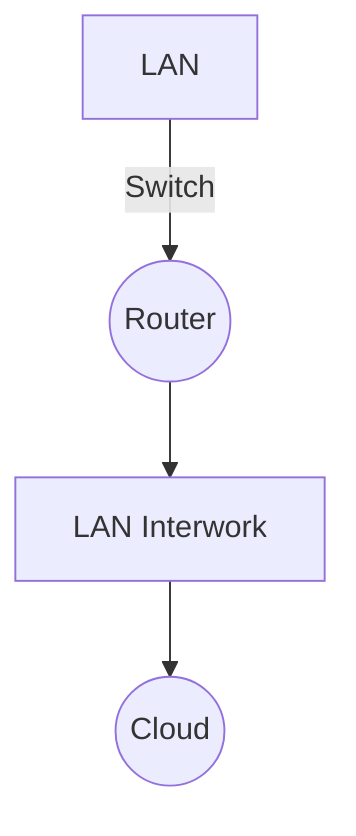

# Clase 3 - Infraestructura TIC

## Material de estudio
- Ver video en Moodle.  
- Leer texto en Moodle.  

## Actividades
- Exposición alrededor de los temas.  
- Exposiciones al azar.  

---

## Propagación y atenuación
- **Pérdida de señal**: causada por distancia o interferencia.  
- **Reflexión**: rebote de la señal al encontrar un obstáculo.  
- **Refracción**: cambio de dirección al pasar de un medio a otro.  
- **Dispersión**: propagación en diferentes direcciones.  

---

## Network Components

### Diagrama en Mermaid
Ejemplo de combinación entre **LAN interwork** y **LAN**:

## Componentes visuales
- **Switch (4 flechas):** Conecta múltiples dispositivos dentro de una LAN.  
- **Router (círculo con X):** Conecta diferentes redes y decide la mejor ruta.  
- **Nube:** Representa infraestructura desconocida, pero existente.  

### Ejemplo
- El proveedor de Claro puede tener una infraestructura gigante en la nube.  
- En la elección de rutas, esta infraestructura permite que desde Colombia se pueda comunicar con Shanghái.  

---

## Intermediary Network Devices
Los dispositivos intermedios son los que gestionan la comunicación entre dispositivos de capa final.  

### Funciones
- Regenerar y transmitir señales de datos.  
- Mostrar información sobre pathways existentes en la red.  
- Notificar sobre otros servicios, errores y fallos de comunicación.  

---

## Definiciones de componentes
- **Wireless Router:** Provee conectividad inalámbrica y enruta el tráfico.  
- **LAN Switch:** Conecta dispositivos en una LAN.  
- **Router:** Conecta diferentes redes y selecciona la ruta óptima.  
- **Multilayer Switch:** Combina funciones de switch y router.  
- **Firewall Appliance (elemento de seguridad):** Filtra y protege el tráfico de red.  

> Nota: Los dispositivos que tienen **lupa** realizan inspección profunda de paquetes (*deep packet inspection*).

## NETWORK MEDIA

### Evolución de los medios de red
- En el mundo de las redes se han presentado cambios a lo largo de los años.  
- **Inicio:** cables de cobre.  
- Luego: **cable coaxial** (tipo de cobre).  
- Actualmente: **pares trenzados**.  

### Mejoras en la construcción
- Uso del **entorchado** que mejora las condiciones de la señal.  
- Permite reducir **ruido e interferencia**.  
- Se miden parámetros físicos para garantizar que el cable cumpla con los requerimientos.  
- Objetivo: evitar interferencias y mal uso de la señal.  

### Señales eléctricas
- La transmisión en cobre se hace con **pulsos eléctricos**.  
- Siempre hay voltaje presente.  
- Ejemplo:  
  - Voltajes altos (+5 voltios) = **1**.  
  - Voltajes bajos (0) = **0**.  

---

## Fibra óptica
- En lugar de pulsos eléctricos, transmite mediante **luz**.  
- La señal se **atenua mucho más lento** que en cobre.  
- Ejemplo: hoy el mundo está cableado principalmente con fibra óptica.  
- Su llegada revolucionó las comunicaciones.  

### Comparación con comunicación satelital
- Antes, para comunicarse de **Colombia a China**, se usaba comunicación **satelital**.  
  - Altura: **36.000 km**.  
  - Ida y vuelta: **72.000 km**.  
  - Problema: generaba **retardo (latencia alta)**.  
- En Colombia, las **instalaciones de fibra óptica** comenzaron hace unos **15 años**.  
- Resultado: se logró **acortar la distancia y reducir la latencia**.  

---

## Comunicaciones inalámbricas
- Existen muchos **estándares** en este mundo.  
- Las redes de **telefonía celular** forman parte de este ecosistema inalámbrico.  
- Utilizan ondas **electromagnéticas**.  
- Las primeras redes inalámbricas surgieron mucho antes, con el desarrollo de **satélites en los años 1930–1940**.

## Diagrama de topología

Son demasiado comunes utilizarlos.  
Una red de comunicaciones siempre va a tener una representación:  
- **Diagrama de topología lógica**  
- **Diagrama de topología física**

La estructura es similar.  
La disposición de los dispositivos y las conexiones se mantienen, lo que se diferencia es lo que se muestra:

- El diagrama físico **ilustra las conexiones físicas y los dispositivos intermediarios de la red**.  
  - La **distribución física** tiene que ver con la ubicación en el sitio.  
  - Debe tener la distribución exacta para no perder tiempo.  

- El diagrama lógico **ilustra los puertos, los dispositivos y el esquema de direccionamiento**.  
  - La distribución física no tiene que ver necesariamente con la distribución lógica.  
  - Aunque físicamente estén en el mismo espacio, **lógicamente pueden pertenecer a redes diferentes**.  

---

### Importancia de cada tipo
- Si debo **solucionar algo lógico**, debo irme al **diagrama lógico** para ver cómo son las dependencias.  
- Los dispositivos deben representarse con la **interfaz que están utilizando**: *slots* e *interfaces*.  
- Todos los dispositivos que vamos a utilizar necesariamente tienen **bocas (interfaces físicas)** para comunicar y conectar.  

En comunicaciones:  
- Cuando hablamos de **puertos**, nos referimos a la **capa de transporte**.  
- El puerto es una disposición lógica que se relaciona con la **capa de sesión**.  

---

### Conclusión
Muchas veces estos planos se deben tener en la cabeza, para saber a dónde se debe conectar.  
La topología tiene que ver con **distribución**, por eso existen la **lógica** y la **física**.  
➡️ Por cada red debemos tener **dos planos**: uno lógico y uno físico.  

---

Fuente: [CCNA desde Cero](https://ccnadesdecero.es/representacion-red-diagrama-de-topologia/)  

## Network of Many Sizes

### Small Home
- Conecta pocos computadores entre sí y a internet.  

### SOHO (Small Office / Home Office)
- Permite que los computadores dentro de un hogar o una oficina remota se conecten a una red corporativa.  

### Medium / Large
- Conecta **cientos o miles de computadores** en una empresa o campus.  
- Ejemplo: universidades, empresas multinacionales.  

### Worldwide
- Conecta **cientos de millones de computadores en todo el mundo**.  
- Ejemplo: cada vez que hablamos de la **World Wide Web (WWW)** nos referimos a este tipo de red.  

# Tipos de Redes

## Clasificación por área de cobertura
- **PAN (Personal Area Network):** Red personal.  
- **LAN (Local Area Network):** Red de área local.  
- **MAN (Metropolitan Area Network):** Red metropolitana.  
- **WAN (Wide Area Network):** Red de área amplia.  
- **GAN (Global Area Network):** Red de alcance global.  

---

## Enfoque en las prácticas
Generalmente se trabaja con **LAN** o **WAN**.

---

## Factores que varían en las infraestructuras de red
- Tamaño del área de cobertura.  
- Número de usuarios conectados.  
- Cantidad de tipos o servicios disponibles.  
- Área de responsabilidad.  

⚠️ **Importante:**  
¿Si conecto muchos equipos es una WAN? **No.**  
Ejemplo: en una universidad pueden estar conectados **3000 dispositivos** y sigue siendo una **LAN**.

---

## Administración de la red
- A mayor número de usuarios/dispositivos → más recursos humanos y tecnológicos para administrarla.  

---

## Diferencias clave
- Una **WAN** conecta múltiples **LAN**.  
  - Ejemplo: la red de **Claro** es una **WAN**.  
  - Claro, a su vez, puede necesitar otros proveedores.  

- Una **LAN** es **única** si todos los recursos dependen de un solo dueño o entidad.  
  - Ejemplo: comunicación entre múltiples edificios conectados por **fibra óptica** (todo pertenece a una misma organización).  

---

## Relación con Datacenters y Nube
- Los **datacenters** y las **nubes** requieren conectividad de red similar, pero la diferencia es **la escala**.  
- Los proveedores de nube (**AWS, Azure, Google Cloud**) son proveedores de **infraestructura de cómputo**.  
  - Ejemplo: si quiero conectarme a **Azure**, requiero el servicio que me habilite ese proveedor.  

