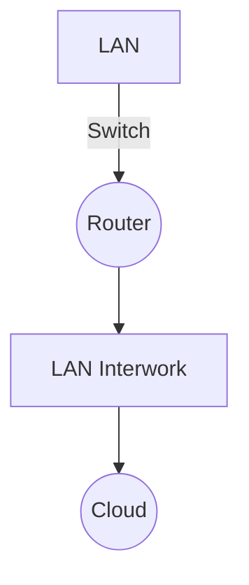

# Clase 3 - Infraestructura TIC

## Material de estudio
- Ver video en Moodle.  
- Leer texto en Moodle.  

## Actividades
- Exposición alrededor de los temas.  
- Exposiciones al azar.  

---

## Propagación y atenuación
- **Pérdida de señal**: causada por distancia o interferencia.  
- **Reflexión**: rebote de la señal al encontrar un obstáculo.  
- **Refracción**: cambio de dirección al pasar de un medio a otro.  
- **Dispersión**: propagación en diferentes direcciones.  

---

## Network Components

### Diagrama en Mermaid
Ejemplo de combinación entre **LAN interwork** y **LAN**:

## Componentes visuales
- **Switch (4 flechas):** Conecta múltiples dispositivos dentro de una LAN.  
- **Router (círculo con X):** Conecta diferentes redes y decide la mejor ruta.  
- **Nube:** Representa infraestructura desconocida, pero existente.  

### Ejemplo
- El proveedor de Claro puede tener una infraestructura gigante en la nube.  
- En la elección de rutas, esta infraestructura permite que desde Colombia se pueda comunicar con Shanghái.  

---

## Intermediary Network Devices
Los dispositivos intermedios son los que gestionan la comunicación entre dispositivos de capa final.  

### Funciones
- Regenerar y transmitir señales de datos.  
- Mostrar información sobre pathways existentes en la red.  
- Notificar sobre otros servicios, errores y fallos de comunicación.  

---

## Definiciones de componentes
- **Wireless Router:** Provee conectividad inalámbrica y enruta el tráfico.  
- **LAN Switch:** Conecta dispositivos en una LAN.  
- **Router:** Conecta diferentes redes y selecciona la ruta óptima.  
- **Multilayer Switch:** Combina funciones de switch y router.  
- **Firewall Appliance (elemento de seguridad):** Filtra y protege el tráfico de red.  

> Nota: Los dispositivos que tienen **lupa** realizan inspección profunda de paquetes (*deep packet inspection*).

## NETWORK MEDIA

### Evolución de los medios de red
- En el mundo de las redes se han presentado cambios a lo largo de los años.  
- **Inicio:** cables de cobre.  
- Luego: **cable coaxial** (tipo de cobre).  
- Actualmente: **pares trenzados**.  

### Mejoras en la construcción
- Uso del **entorchado** que mejora las condiciones de la señal.  
- Permite reducir **ruido e interferencia**.  
- Se miden parámetros físicos para garantizar que el cable cumpla con los requerimientos.  
- Objetivo: evitar interferencias y mal uso de la señal.  

### Señales eléctricas
- La transmisión en cobre se hace con **pulsos eléctricos**.  
- Siempre hay voltaje presente.  
- Ejemplo:  
  - Voltajes altos (+5 voltios) = **1**.  
  - Voltajes bajos (0) = **0**.  

---

## Fibra óptica
- En lugar de pulsos eléctricos, transmite mediante **luz**.  
- La señal se **atenua mucho más lento** que en cobre.  
- Ejemplo: hoy el mundo está cableado principalmente con fibra óptica.  
- Su llegada revolucionó las comunicaciones.  

### Comparación con comunicación satelital
- Antes, para comunicarse de **Colombia a China**, se usaba comunicación **satelital**.  
  - Altura: **36.000 km**.  
  - Ida y vuelta: **72.000 km**.  
  - Problema: generaba **retardo (latencia alta)**.  
- En Colombia, las **instalaciones de fibra óptica** comenzaron hace unos **15 años**.  
- Resultado: se logró **acortar la distancia y reducir la latencia**.  

---

## Comunicaciones inalámbricas
- Existen muchos **estándares** en este mundo.  
- Las redes de **telefonía celular** forman parte de este ecosistema inalámbrico.  
- Utilizan ondas **electromagnéticas**.  
- Las primeras redes inalámbricas surgieron mucho antes, con el desarrollo de **satélites en los años 1930–1940**.  

