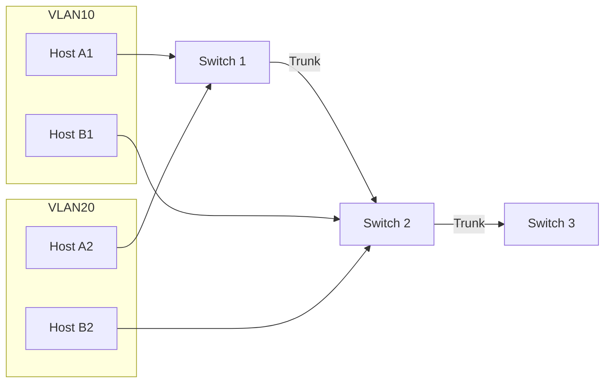
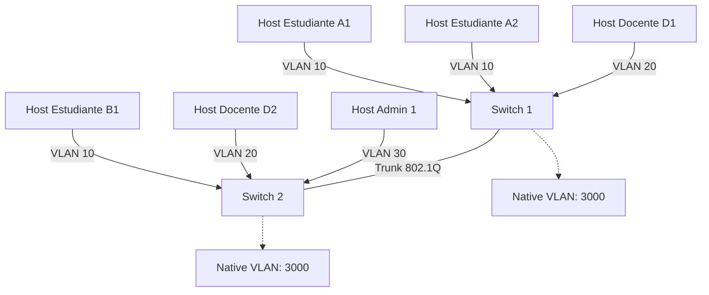
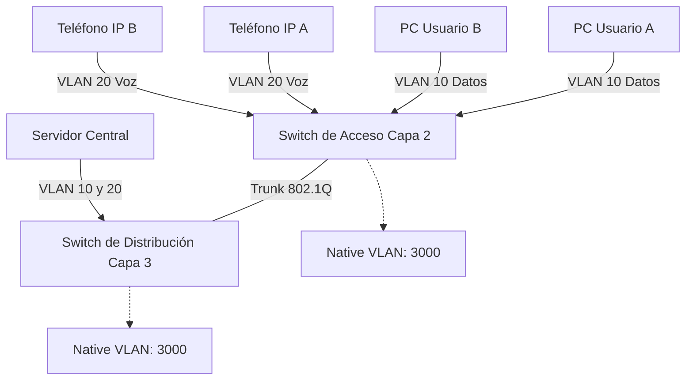

# Clase 27/10/2025
## Infraestructura TIC - 4ta clase

### Defining VLAN Trunks

A trunk is a point-to-point link between two network devices.  

- Allows more than one VLAN  
- Extends the VLAN across the entire network  
- Supports protocol **802.1Q**  
- Historically, Cisco used **VTP** and **ISL**  

#### Network without VLANs
- Possible, but in some cases, broadcast traffic is sent to all devices.  
- Broadcast traffic = like a person shouting in a room.  
- All devices hear both unicast and broadcast.  

#### Network with VLANs
- Traffic is segmented per VLAN.  
- Broadcast only reaches devices in the same VLAN.  
- Like a network inside another network.  

#### LAN Traffic Management
- When managing LAN traffic, controlling broadcast is critical.  
- Tools like **Wireshark** allow seeing network traffic.  
- Many protocols generate broadcast, which can overload the network.  
- Broadcast = like a room where everyone shouts at once, creating noise.  
- Some protocols rely on broadcast; it's unavoidable.  

### VLAN Identification with a TAG
- VLAN tagging is repeated across protocols; only the header differs.  
- Each Layer 2 protocol handles headers differently.  

### Direccionamiento IP y formatos

- **IPv4**: se visualiza en **decimal**, pero internamente se maneja en **binario**.  
- **IPv6**: se maneja en **hexadecimal**, igual que las **MAC addresses**.  
- En redes nos movemos constantemente entre **binario, decimal y hexadecimal** según la capa y el protocolo.  

### VLANs y QoS

- Los frames VLAN incluyen **3 bits de prioridad (QoS)** para manejar tráfico crítico como **voz y video**, donde no se permiten pérdidas de datos.  
- Existe un **bit de dependencia**, utilizado en tecnologías como **Token Ring**.  
- **VLAN ID**: 12 bits → soporta hasta **4096 VLANs**.

### Distribución de VLANs

- Las VLANs **no requieren una distribución homogénea** en todos los dispositivos.  
- Ejemplo: un edificio escolar puede tener:
  - VLAN estudiantes
  - VLAN docentes
  - VLAN administrativos  

- Dependiendo de los accesos:
  - Solo VLAN de estudiantes para aulas públicas.  
  - VLAN de docentes solo para ciertos accesos.  
  - No todas las VLANs deben estar presentes en todos los switches o dispositivos.  

### Native VLAN y 802.1Q

- Basado en **802.1Q**, cada VLAN inserta un **VLAN Tag (ID)** dentro de la **cabecera del frame**.  
- **Native VLAN**: uso antiguo, concepto de **abstracción** para redes donde algunos dispositivos no soportaban tagging.  
- Antes se usaban **HUBs** para dividir cables, pero eso ya no es recomendable.  
- Solo **switches y routers** pueden manejar trunks correctamente.  

#### Consideraciones de seguridad

- Si la **VLAN nativa es la 1**, es un objetivo común para atacantes.  
- Se recomienda cambiar la VLAN nativa a un número no estándar, por ejemplo **VLAN 3000**.  
- Ambos extremos del trunk deben coincidir en la **VLAN nativa** configurada.  

### 802.1Q: Funcionamiento

- Inserta un **TAG de 4 bytes** en el **frame Ethernet**.  
  - 3 bits → **Prioridad (QoS)**  
  - 1 bit → **CFI (Canonical Format Indicator / dependencia)**  
  - 12 bits → **VLAN ID**  
- Permite que múltiples VLANs compartan un mismo enlace físico (**trunk**), pero manteniendo segregación de tráfico.  
- Es la base del **VLAN trunking moderno**.  

### VLAN de Voz

- Actualmente, la **VLAN de voz** tiende a desaparecer:  
  - Los **conmutadores telefónicos** tradicionales, incluso digitales, están siendo reemplazados.  
  - Hoy en día, muchas empresas simplemente asignan **móviles a los empleados** en lugar de mantener extensiones físicas.  

- Ejemplo:  
  - Si tengo una extensión pero no estoy en la oficina, no puedo contestar.  
  - La estructura existe pero tiende a desaparecer con la digitalización.  

- **CoS (Class of Service) en Layer 2**  
  - Permite **priorizar tráfico crítico**: voz, video y otros tipos de tráfico que requieren baja latencia.  
  - Las **VLANs de acceso** son donde se conectan los dispositivos de usuario final y pueden priorizar tráfico.  

---

### Configuración de VLAN y Switches

- **Rangos de VLAN en switches Catalyst**:  
  - Los switches son como coches: muchos modelos y capacidades distintas.  
  - **Switches de capa 2**: ideales para entornos de **acceso** (usuarios finales).  
  - **Switches de capa 3**: usados en **distribución o core**, donde se requiere **procesamiento de rutas y alta velocidad**.  

- Arquitectura jerárquica de red:  
  1. **Capa de acceso** → switches de capa 2, conectan dispositivos finales.  
  2. **Capa de distribución** → switches de capa 3, gestionan el enrutamiento interno y agregación.  
  3. **Capa core** → backbone de alta velocidad y redundancia.  

- Switches de capa 3:  
  - Parecen routers, pueden manejar tráfico de capa 2 y capa 3.  
  - Se utilizan para servidores que responden a muchas peticiones simultáneas o requieren alta velocidad.  

- Fabricantes y modelos:  
  - Cada fabricante tiene **múltiples modelos**, con **capacidad de procesamiento, memoria y sistema operativo** distintos.  
  - Ejemplo: Cisco Catalyst tiene series con distintos OS y comandos (`show vlan brief`) para ver VLANs, puertos y estado.  
  - La **VLAN nativa** viene preconfigurada, normalmente VLAN 1.  

---

### Virtualización de Redes

- Para redes grandes:  
  - Si necesitamos 200 puertos, **agrupamos switches** (stacking).  
  - Todas las interfaces pertenecen inicialmente a la **VLAN default** (VLAN 1).  

- VLANs reservadas en Cisco:  
  - 1002 a 1005 → no se pueden borrar, antiguamente usadas para **Token Ring y FDDI**.  
  - VLANs 1 a 1005 → rango estándar para empresas medianas.  

---

### Mermaid: VLAN de Voz y Acceso

