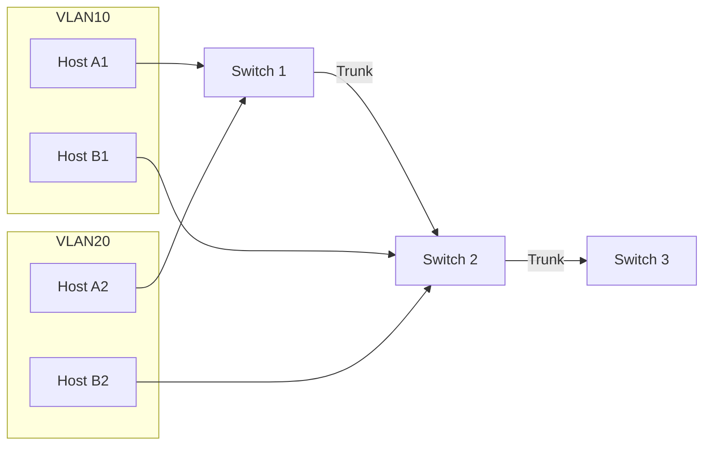
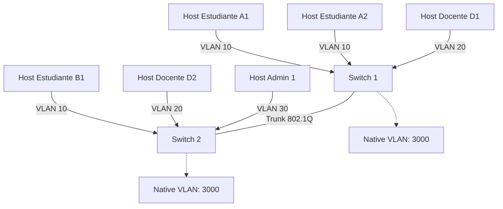
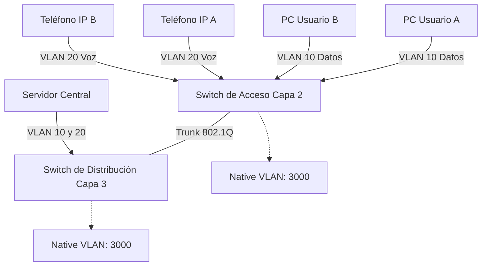
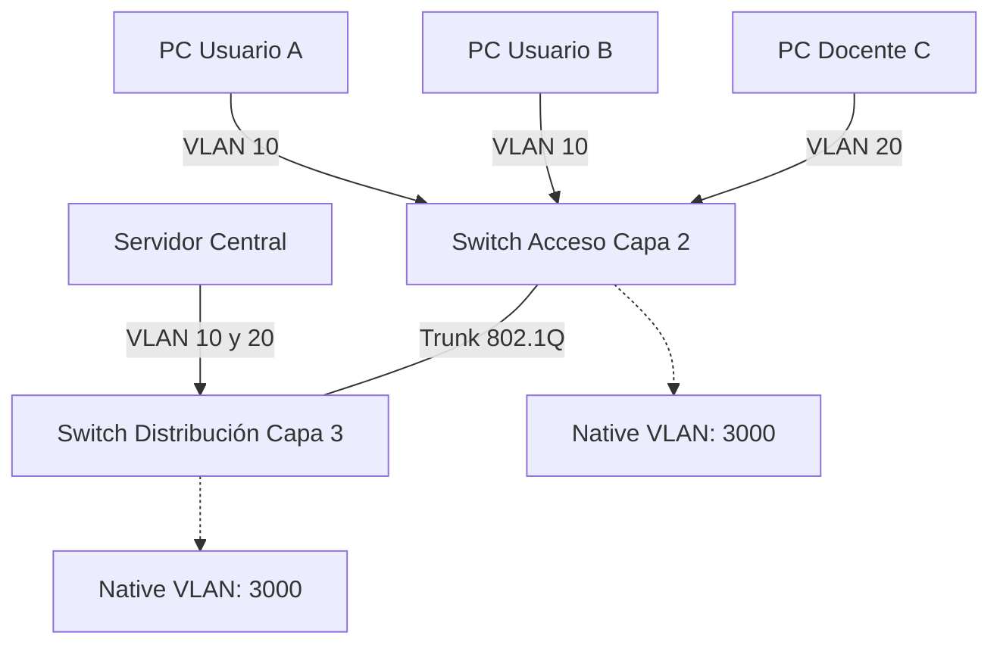

# Clase 27/10/2025
## Infraestructura TIC - 4ta clase

### Defining VLAN Trunks

A trunk is a point-to-point link between two network devices.  

- Allows more than one VLAN  
- Extends the VLAN across the entire network  
- Supports protocol **802.1Q**  
- Historically, Cisco used **VTP** and **ISL**  

#### Network without VLANs
- Possible, but in some cases, broadcast traffic is sent to all devices.  
- Broadcast traffic = like a person shouting in a room.  
- All devices hear both unicast and broadcast.  

#### Network with VLANs
- Traffic is segmented per VLAN.  
- Broadcast only reaches devices in the same VLAN.  
- Like a network inside another network.  

#### LAN Traffic Management
- When managing LAN traffic, controlling broadcast is critical.  
- Tools like **Wireshark** allow seeing network traffic.  
- Many protocols generate broadcast, which can overload the network.  
- Broadcast = like a room where everyone shouts at once, creating noise.  
- Some protocols rely on broadcast; it's unavoidable.  

### VLAN Identification with a TAG
- VLAN tagging is repeated across protocols; only the header differs.  
- Each Layer 2 protocol handles headers differently.  


### Direccionamiento IP y formatos

- **IPv4**: se visualiza en **decimal**, pero internamente se maneja en **binario**.  
- **IPv6**: se maneja en **hexadecimal**, igual que las **MAC addresses**.  
- En redes nos movemos constantemente entre **binario, decimal y hexadecimal** según la capa y el protocolo.  

### VLANs y QoS

- Los frames VLAN incluyen **3 bits de prioridad (QoS)** para manejar tráfico crítico como **voz y video**, donde no se permiten pérdidas de datos.  
- Existe un **bit de dependencia**, utilizado en tecnologías como **Token Ring**.  
- **VLAN ID**: 12 bits → soporta hasta **4096 VLANs**.

### Distribución de VLANs

- Las VLANs **no requieren una distribución homogénea** en todos los dispositivos.  
- Ejemplo: un edificio escolar puede tener:
  - VLAN estudiantes
  - VLAN docentes
  - VLAN administrativos  

- Dependiendo de los accesos:
  - Solo VLAN de estudiantes para aulas públicas.  
  - VLAN de docentes solo para ciertos accesos.  
  - No todas las VLANs deben estar presentes en todos los switches o dispositivos.  

### Native VLAN y 802.1Q

- Basado en **802.1Q**, cada VLAN inserta un **VLAN Tag (ID)** dentro de la **cabecera del frame**.  
- **Native VLAN**: uso antiguo, concepto de **abstracción** para redes donde algunos dispositivos no soportaban tagging.  
- Antes se usaban **HUBs** para dividir cables, pero eso ya no es recomendable.  
- Solo **switches y routers** pueden manejar trunks correctamente.  

#### Consideraciones de seguridad

- Si la **VLAN nativa es la 1**, es un objetivo común para atacantes.  
- Se recomienda cambiar la VLAN nativa a un número no estándar, por ejemplo **VLAN 3000**.  
- Ambos extremos del trunk deben coincidir en la **VLAN nativa** configurada.  

### 802.1Q: Funcionamiento

- Inserta un **TAG de 4 bytes** en el **frame Ethernet**.  
  - 3 bits → **Prioridad (QoS)**  
  - 1 bit → **CFI (Canonical Format Indicator / dependencia)**  
  - 12 bits → **VLAN ID**  
- Permite que múltiples VLANs compartan un mismo enlace físico (**trunk**), pero manteniendo segregación de tráfico.  
- Es la base del **VLAN trunking moderno**.  


### VLAN de Voz

- Actualmente, la **VLAN de voz** tiende a desaparecer:  
  - Los **conmutadores telefónicos** tradicionales, incluso digitales, están siendo reemplazados.  
  - Hoy en día, muchas empresas simplemente asignan **móviles a los empleados** en lugar de mantener extensiones físicas.  

- Ejemplo:  
  - Si tengo una extensión pero no estoy en la oficina, no puedo contestar.  
  - La estructura existe pero tiende a desaparecer con la digitalización.  

- **CoS (Class of Service) en Layer 2**  
  - Permite **priorizar tráfico crítico**: voz, video y otros tipos de tráfico que requieren baja latencia.  
  - Las **VLANs de acceso** son donde se conectan los dispositivos de usuario final y pueden priorizar tráfico.  

---

### Configuración de VLAN y Switches

- **Rangos de VLAN en switches Catalyst**:  
  - Los switches son como coches: muchos modelos y capacidades distintas.  
  - **Switches de capa 2**: ideales para entornos de **acceso** (usuarios finales).  
  - **Switches de capa 3**: usados en **distribución o core**, donde se requiere **procesamiento de rutas y alta velocidad**.  

- Arquitectura jerárquica de red:  
  1. **Capa de acceso** → switches de capa 2, conectan dispositivos finales.  
  2. **Capa de distribución** → switches de capa 3, gestionan el enrutamiento interno y agregación.  
  3. **Capa core** → backbone de alta velocidad y redundancia.  

- Switches de capa 3:  
  - Parecen routers, pueden manejar tráfico de capa 2 y capa 3.  
  - Se utilizan para servidores que responden a muchas peticiones simultáneas o requieren alta velocidad.  

- Fabricantes y modelos:  
  - Cada fabricante tiene **múltiples modelos**, con **capacidad de procesamiento, memoria y sistema operativo** distintos.  
  - Ejemplo: Cisco Catalyst tiene series con distintos OS y comandos (`show vlan brief`) para ver VLANs, puertos y estado.  
  - La **VLAN nativa** viene preconfigurada, normalmente VLAN 1.  

---

### Virtualización de Redes

- Para redes grandes:  
  - Si necesitamos 200 puertos, **agrupamos switches** (stacking).  
  - Todas las interfaces pertenecen inicialmente a la **VLAN default** (VLAN 1).  

- VLANs reservadas en Cisco:  
  - 1002 a 1005 → no se pueden borrar, antiguamente usadas para **Token Ring y FDDI**.  
  - VLANs 1 a 1005 → rango estándar para empresas medianas.  

---

### Mermaid: VLAN de Voz y Acceso


### Conceptos clave

- **No existen recetas universales en redes**  
  - Cada red es diferente; lo que funciona en una no garantiza que funcione igual en otra.  
  - La configuración depende de necesidades específicas del sitio, cantidad de usuarios, dispositivos y políticas de seguridad.  

- **Almacenamiento en switches Cisco**  
  - Todo lo que se guarda en la **Flash** es **no volátil**, como un respaldo.  
    - Ejemplo: si borras el archivo `vlan.dat`, **pierdes todas las VLANs almacenadas**.  
  - Siempre existe algún lugar donde se almacena la información de las VLANs.  

- **VLAN extendidas (1006 a 4095)**  
  - Normalmente usadas por **proveedores de servicios de comunicación (ISP)**.  
  - Diferencia con VLAN normales: se almacenan en **Running Config (RAM)** y requieren respaldo frecuente.  
  - Para usuarios finales es raro trabajar con estas VLANs.  

- **VLAN normales (1 a 1005)**  
  - Usadas en empresas y entornos académicos.  
  - Pueden ser creadas, modificadas y borradas con facilidad.  

---

### Creación de VLANs en Cisco

- Trabajaremos con **Packet Tracer** para prácticas académicas.  
- Los mismos comandos aplican en **dispositivos físicos**, ajustando nombres de interfaces y puertos.  

#### Comandos IOS básicos para VLANs

| Tarea | Comando IOS | Descripción |
|-------|------------|-------------|
| Entrar al switch | `enable` | Acceder al modo privilegiado |
| Entrar al modo de configuración | `configure terminal` | Permite configurar VLANs, interfaces, etc. |
| Crear una VLAN | `vlan 10` | Crea VLAN con ID 10 |
| Nombrar VLAN | `name Estudiantes` | Asigna un nombre descriptivo a la VLAN |
| Mostrar VLANs | `show vlan brief` | Muestra número, nombre, estado y puertos de VLANs |
| Asignar puerto a VLAN | `interface fastEthernet 0/1`<br>`switchport mode access`<br>`switchport access vlan 10` | Configura puerto como acceso y lo asigna a la VLAN |
| Guardar configuración | `write memory` o `copy running-config startup-config` | Guarda la configuración en NVRAM para que persista tras reinicio |
| Borrar VLAN | `no vlan 10` | Elimina la VLAN seleccionada |
| Salir al modo anterior | `exit` | Retrocede un nivel de configuración |

---

### Ejemplo visual: VLANs y Trunk


- En **Packet Tracer** se simula igual que en equipos físicos; la práctica académica permite entender **trunks**, **VLANs nativas** y **asignación de puertos**.  

- Siempre verificar la **Running Config** y guardar en **Startup Config** para persistencia.  

- Las **VLANs extendidas** rara vez se usan en entornos de aprendizaje; se concentran en **proveedores de servicios**.

  # Switch: Modo Acceso y Modo Troncal

### Modos de un puerto de switch

Un puerto de switch puede operar en dos modos principales:

1. **Modo Acceso (Access Mode)**  
   - Se conecta a **dispositivos finales** (PCs, impresoras, teléfonos IP).  
   - Solo pertenece a **una VLAN** específica.  
   - No agrega tags VLAN al tráfico que sale por el puerto.  

2. **Modo Troncal (Trunk Mode)**  
   - Se conecta a **otros switches o routers**.  
   - Permite transportar **varias VLANs** por el mismo enlace físico usando **802.1Q**.  
   - Los frames de cada VLAN llevan un **tag VLAN ID**.  

---

### VLAN de Datos y VLAN de Voz

- **Data VLAN (VLAN de Datos)**  
  - Para tráfico de PCs y dispositivos normales.  
  - Ejemplo: VLAN 10 → “Estudiantes”  

- **Voice VLAN (VLAN de Voz)**  
  - Para teléfonos IP y tráfico de voz.  
  - Permite **priorizar el tráfico** usando CoS (Class of Service).  
  - Ejemplo: VLAN 20 → “Voz”  

- Una interfaz puede configurarse **como puerto de acceso de datos** y simultáneamente soportar **VLAN de voz**.  

---

### Ejemplo de comandos IOS para configurar un puerto

```bash
Switch> enable
Switch# configure terminal
Enter configuration commands, one per line. End with CNTL/Z.

Switch(config)# interface fastEthernet 0/1
Switch(config-if)# switchport mode access
Switch(config-if)# switchport access vlan 10
Switch(config-if)# switchport voice vlan 20
Switch(config-if)# spanning-tree portfast
Switch(config-if)# exit

Switch(config)# exit
Switch# write memory
Building configuration...
[OK]
Switch#
```

---

 **Notas:**

- Un puerto en **modo acceso** solo transporta tráfico de una VLAN (excepto la VLAN de voz si se configura).  
- Un puerto en **modo troncal** puede transportar múltiples VLANs, tanto de **datos como de voz**.  
- Esta configuración es **esencial para entornos de voz sobre IP** y redes LAN académicas o empresariales.  

# VLANs Trunk

### Modos de puerto en un switch

Un puerto de switch puede operar en dos modos principales:

1. **Modo Acceso (Access Mode)**
   - Conecta **dispositivos finales** como PCs, impresoras o teléfonos IP.  
   - Solo pertenece a **una VLAN** específica.  
   - No agrega tags VLAN al tráfico que sale por el puerto.  

2. **Modo Troncal (Trunk Mode)**
   - Conecta **switches entre sí o routers**.  
   - Transporta **varias VLANs** simultáneamente usando **802.1Q**.  
   - Los frames llevan un **tag VLAN ID** que permite distinguir el tráfico.  
   - Si una interfaz no es VLAN de acceso, **por defecto funciona como troncal**.  

---

### Diferencias clave entre Acceso y Troncal

| Característica | Modo Acceso | Modo Troncal |
|----------------|------------|--------------|
| Conecta a | Dispositivos finales | Otros switches o routers |
| VLANs transportadas | 1 VLAN (excepto voz si configurada) | Múltiples VLANs |
| Tag de VLAN | No | Sí, usando 802.1Q |
| Uso típico | PCs, impresoras, teléfonos | Trunks entre switches, routers y firewalls |
| Prioridad | Solo datos del puerto | Permite tráfico priorizado de voz/datos |

---

### VLANs de Acceso y Voz (Ejemplo)

- **Data VLAN** → VLAN 10 → PC de usuario  
- **Voice VLAN** → VLAN 20 → Teléfono IP  

- Una interfaz de acceso puede soportar **VLAN de datos y de voz simultáneamente**.

---

### Comandos IOS para configurar puertos

| Tarea | Comando IOS | Descripción |
|-------|------------|-------------|
| Entrar al switch | `enable` | Modo privilegiado |
| Entrar a configuración global | `configure terminal` | Configuración de VLANs y interfaces |
| Seleccionar interfaz | `interface fastEthernet 0/1` | Puerto físico a configurar |
| Configurar puerto como acceso | `switchport mode access` | Establece modo acceso |
| Asignar VLAN de datos | `switchport access vlan 10` | Puerto pertenece a VLAN de datos |
| Configurar VLAN de voz | `switchport voice vlan 20` | Prioriza tráfico de voz |
| Configurar puerto como troncal | `switchport mode trunk` | Permite transportar múltiples VLANs |
| Permitir VLANs en troncal | `switchport trunk allowed vlan 10,20` | Filtra las VLANs que pasan por el tronco |
| Salir de la interfaz | `exit` | Retorna a modo global |

---

**Notas:**
- Los **puertos de acceso** son para dispositivos finales.  
- Los **puertos troncales** son esenciales para que los switches compartan varias VLANs en la misma conexión física.  
- La configuración correcta de **trunks y acceso** es fundamental para mantener segregación de tráfico y seguridad en la red LAN.  

