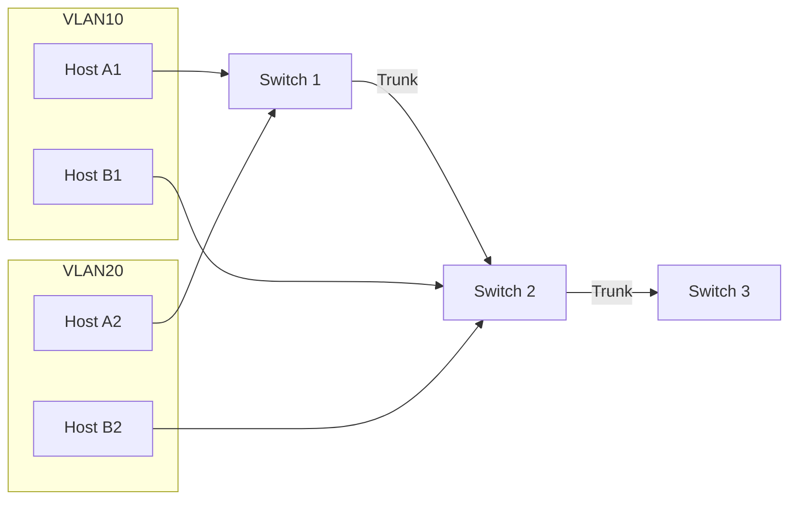

# Clase 27/10/2025
## Infraestructura TIC - 4ta clase

### Defining VLAN Trunks

A trunk is a point-to-point link between two network devices.  

- Allows more than one VLAN  
- Extends the VLAN across the entire network  
- Supports protocol **802.1Q**  
- Historically, Cisco used **VTP** and **ISL**  

#### Network without VLANs
- Possible, but in some cases, broadcast traffic is sent to all devices.  
- Broadcast traffic = like a person shouting in a room.  
- All devices hear both unicast and broadcast.  

#### Network with VLANs
- Traffic is segmented per VLAN.  
- Broadcast only reaches devices in the same VLAN.  
- Like a network inside another network.  

#### LAN Traffic Management
- When managing LAN traffic, controlling broadcast is critical.  
- Tools like **Wireshark** allow seeing network traffic.  
- Many protocols generate broadcast, which can overload the network.  
- Broadcast = like a room where everyone shouts at once, creating noise.  
- Some protocols rely on broadcast; it's unavoidable.  

### VLAN Identification with a TAG
- VLAN tagging is repeated across protocols; only the header differs.  
- Each Layer 2 protocol handles headers differently.  

