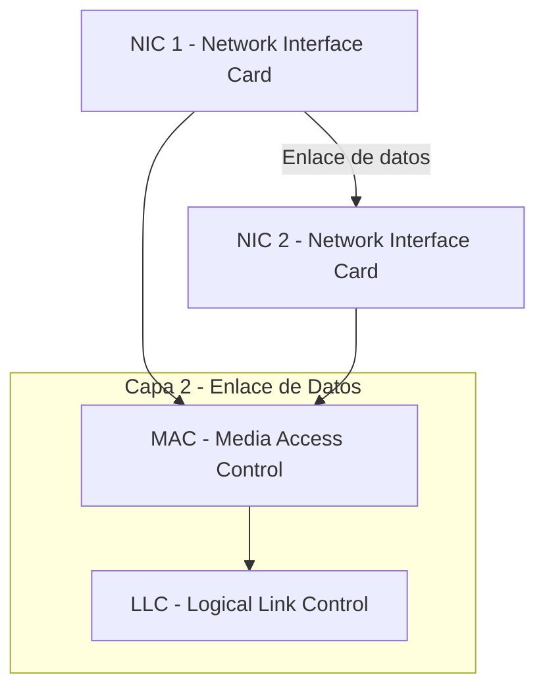
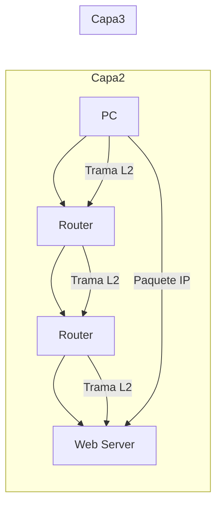

# Clase 1 – Capa de Enlace de Datos (Data Link Layer)

La **capa 2** se puede entender como un “teléfono roto”: en el proceso de comunicación todo pasa de **vecino a vecino**.  
Un dispositivo se conecta directamente a otro, y si se introduce un error, este se mantiene.

- Responsable de la comunicación entre dispositivos finales.  
- Las **tarjetas de red (NIC)** funcionan en capa 2, usando **direcciones físicas (MAC)**.  
- Une lo **físico** (señales eléctricas/ópticas) con lo **lógico** (datos interpretables).  
- Empaqueta lo que llega del mundo físico y lo envía hacia niveles superiores.  
- Se comunica:
  - Hacia abajo con la **capa física (1)**.  
  - Hacia arriba con la **capa de red (3)**.  
- Tiene funciones de **detección y, en algunos casos, corrección de errores**.  
  - Si detecta un error, descarta la información.
 
   ## Gráfico en Mermaid

## Relación entre capas

- **Capa 2 (LAN)** → comunicación local con direcciones físicas (MAC).  
- **Capa 3 (WAN)** → comunicación global con direcciones lógicas (IP).  

### Ejemplo de encabezados
- **Capa 2 (Header L2):** `Destination NIC : Source NIC`  
- **Capa 3 (Packet L3):** `Source IP : Destination IP`  

En capa 3 siempre están presentes **IPV4** o **IPV6**.

## Direcciones en la red
Todos los dispositivos tienen múltiples direcciones:  
- **Hardware (físicas, MAC).**  
- **Software (lógicas, IP).**

## División de la Capa de Enlace de Datos
La **IEEE 802.7** divide la capa 2 en dos subcapas:

1. **MAC (Media Access Control)**
   - Dirección MAC (única en un entorno LAN).  
   - Controla el acceso al medio físico.  
   - Decide **cuándo colocar o retirar información** en el medio.  
   - Ejemplo: un semáforo en una intersección sin señales, para evitar colisiones.  

2. **LLC (Logical Link Control)**
   - Encargada de la comunicación lógica entre dispositivos.  

## Analogías para la Subcapa MAC
- **Clase:** si alguien más habla al mismo tiempo que el profesor, hay colisión de información. Para hablar, se pide la palabra.  
- **Tránsito:** semáforo que decide cuándo pasar o detenerse para evitar choques.  

## Tipos de Comunicación

- **Unicast:** comunicación hacia un único receptor.  
  - Ejemplo: mensaje directo a una persona específica.  
- **Multicast:** comunicación hacia varios receptores que cumplen una condición.  
  - Ejemplo: mensaje solo para las mujeres del salón.  
- **Broadcast:** comunicación hacia todos los dispositivos.  
  - Ejemplo: transmisión de radio.  
- **Anycast:** comunicación hacia varios, pero **solo responde el primero que cumple el criterio**.  
  - Ejemplo: mensaje para las mujeres del salón → responde la más cercana.
 
    ---

    ## Técnicas de acceso al medio (MAC)

Para evitar **ruido** y **colisiones** se utilizan técnicas de acceso al medio:  

- En **broadcast** la posibilidad de ruido es más alta.  
- Depende del escenario si hay ruido o no.  

### Clasificación

1. **Técnicas de contención (competición):**  
   - Ejemplo: tráfico en una ciudad sin señalización.  
   - Todos compiten por el medio.  

2. **Técnicas mediadas (controladas):**  
   - Un mediador decide quién puede hablar.  
   - El objeto con mayor autorización decide el turno.  
   - Ejemplos: **Token Ring**, **Token Bus**.  
     - Son técnicas casi en desuso.  
     - Funcionan como una carrera de relevos:  
       - El “token” da permiso para hablar.  
       - Si no se usa, se pierde tiempo.  
       - El turno debe dar toda la vuelta antes de volver.  
      
--- TAREA
## Técnicas de Contención (CSMA)

Las técnicas de contención se utilizan cuando varios dispositivos comparten el mismo medio físico y pueden generar **colisiones**.  
El protocolo más común es **CSMA (Carrier Sense Multiple Access)**, que significa:

- **Carrier Sense (Escucha del canal):**  
  Antes de transmitir, el dispositivo "escucha" el medio para verificar si está libre o si alguien más está transmitiendo.  
- **Multiple Access (Acceso múltiple):**  
  Todos los dispositivos comparten el mismo medio y pueden intentar transmitir cuando el canal esté disponible.  

---

## Variantes de CSMA

### 1. **CSMA/CD (Collision Detection)**

- **Definición:**  
  Carrier Sense Multiple Access con **Detección de Colisiones**.  
  Fue utilizado en **Ethernet clásico (IEEE 802.3, con cable coaxial)**.  

- **Funcionamiento:**  
  1. El dispositivo escucha el medio.  
  2. Si está libre, comienza a transmitir.  
  3. Mientras transmite, sigue escuchando el medio para detectar si ocurre una colisión.  
  4. Si hay colisión:  
     - Se detiene la transmisión.  
     - Envía una señal de interferencia (jamming signal).  
     - Espera un tiempo aleatorio (backoff).  
     - Intenta retransmitir.  

- **Ejemplo práctico:**  
  Es como varias personas hablando en una sala. Si dos hablan al mismo tiempo y se dan cuenta, se callan, esperan un momento aleatorio y luego vuelven a intentar hablar.  

- **Limitaciones:**  
  - Funciona bien en cable coaxial compartido.  
  - No es útil en **Wi-Fi** porque en radio no siempre es posible detectar colisiones en el aire.  
  - Hoy en día está prácticamente en desuso, reemplazado por **switches Ethernet full-duplex**, donde no hay colisiones.  

---

### 2. **CSMA/CA (Collision Avoidance)**

- **Definición:**  
  Carrier Sense Multiple Access con **Evitación de Colisiones**.  
  Utilizado principalmente en **redes inalámbricas (Wi-Fi, IEEE 802.11)**.  

- **Funcionamiento:**  
  1. El dispositivo escucha el canal (Carrier Sense).  
  2. Si el medio está libre, espera un tiempo aleatorio antes de transmitir (backoff aleatorio).  
  3. Si detecta que alguien más transmite durante la espera, reinicia el contador y vuelve a esperar.  
  4. Algunas implementaciones usan RTS/CTS (**Request to Send / Clear to Send**):  
     - El emisor solicita permiso para enviar.  
     - El receptor responde otorgando el permiso.  
     - Esto reduce el problema del **nodo oculto** (cuando un dispositivo no escucha a otro, pero ambos interfieren con el mismo receptor).  

- **Ejemplo práctico:**  
  Es como una conversación en un grupo grande: antes de hablar, haces una pausa y miras si alguien más va a hablar. Si varios levantan la mano, esperan turnos aleatorios antes de empezar.  

- **Ventajas:**  
  - Reduce colisiones en ambientes inalámbricos.  
  - Permite mejor aprovechamiento del medio en Wi-Fi.  

- **Limitaciones:**  
  - Mayor retardo por el mecanismo de prevención.  
  - Menor eficiencia en redes con alta saturación.  

---

## Comparación rápida

| Característica | **CSMA/CD** | **CSMA/CA** |
|----------------|-------------|-------------|
| Uso principal  | Ethernet clásico (cable coaxial, half-duplex) | Redes inalámbricas (Wi-Fi) |
| Estrategia     | Detecta la colisión y actúa | Intenta prevenir colisiones antes de ocurrir |
| Colisiones     | Se producen y deben resolverse | Se reducen al mínimo posible |
| Estado actual  | Obsoleto (Ethernet moderno usa switches full-duplex) | Vigente en Wi-Fi (802.11) |

---

# Dominios de Colisión y Broadcast

## Dominio de Colisión

- **Definición:**  
  Un **dominio de colisión** es un entorno donde varios dispositivos comparten el mismo medio y pueden generar colisiones si transmiten al mismo tiempo.  

- **Ejemplo:**  
  Un salón de clase donde todos hablan simultáneamente → se produce colisión de información.  
  Si en un edificio hay 20 salones, pueden existir 20 dominios de colisión.  

- **Hubs:**  
  - Los **hubs** no dividen dominios de colisión.  
  - Todos los dispositivos conectados al hub forman un único dominio de colisión.  
  - Uso del medio es ineficiente:  
    - Ejemplo histórico → con hub se aprovechaba solo un **30% del tiempo efectivo** (de 60 minutos, solo 18 realmente útiles).  

---

## Dominio de Broadcast

- **Definición:**  
  Un **dominio de broadcast** es el entorno en el que, cuando un dispositivo envía un mensaje broadcast, **todos los demás dispositivos pueden escucharlo**.  
- Está relacionado a veces con el dominio de colisión, pero no son lo mismo.  

---

## Impacto del Tipo de Dispositivo

- **Capa Física (Hubs):**  
  - Amplían el dominio de colisión al número de dispositivos conectados.  
  - No segmentan ni mejoran eficiencia.  

- **Capa 2 (Switches):**  
  - Los **switches** subdividen los dominios de colisión.  
  - Implementan **microsegmentación**, cada enlace es un dominio de colisión independiente.  
  - Mejoran significativamente la eficiencia de la red.  

- **Capa 3 (Routers):**  
  - Los **routers** dividen los **dominios de broadcast**.  
  - Cada interfaz del router crea un nuevo dominio de broadcast y de colisión.  

---

## Ejemplos de Escenarios

- **Con Hub:**  
  - 30 hubs conectados → **1 único dominio de colisión**.  
  - Todos los dispositivos compiten por el mismo medio.  
  - Ineficiencia: múltiples colisiones.  

- **Con Switch:**  
  - Muchos dominios de colisión (uno por puerto).  
  - Ningún dispositivo compite con otro en el mismo medio.  
  - Comunicación más eficiente y sin colisiones.  

---

# Subcapa MAC y Estándares Ethernet

La **subcapa MAC (Medium Access Control)** regula cómo los dispositivos acceden al medio físico compartido.  
Aunque parece un paso sencillo (“entrar al medio”), en realidad implica manejar **colisiones, control de acceso y coordinación** con protocolos de mayor nivel.  

Todo lo que sucede en la **capa de enlace de datos** depende directamente del **medio físico** y del estándar implementado.  

---

## Ethernet (IEEE 802.3)

- Primer estándar ampliamente usado para redes locales (LAN).  
- Velocidad original: **10 Mbps**.  
- Acceso al medio: **CSMA/CD (Carrier Sense Multiple Access with Collision Detection)**.  
- Se utilizaban topologías de bus con cable coaxial y, posteriormente, cableado UTP.  
- Hoy se emplea más en su forma de **Ethernet conmutado (switching)**, eliminando colisiones.  

---

## Fast Ethernet (IEEE 802.3u)

- Evolución de Ethernet para soportar **100 Mbps**.  
- Compatibilidad con Ethernet a 10 Mbps (autonegociación).  
- Mantiene el uso de **CSMA/CD**, aunque con switches las colisiones desaparecen.  
- Estándares físicos:
  - **100BASE-TX** (UTP Cat 5, 2 pares).  
  - **100BASE-FX** (fibra óptica).  

---

## Gigabit Ethernet (IEEE 802.3z / 802.3ab)

- Aumenta la velocidad hasta **1 Gbps (1000 Mbps)**.  
- Estándares físicos:
  - **1000BASE-SX**: fibra óptica multimodo.  
  - **1000BASE-LX**: fibra óptica monomodo.  
  - **1000BASE-T**: cableado UTP Cat 5e o superior.  
- Se mantiene la compatibilidad con Fast Ethernet y Ethernet.  
- Usualmente implementado con switches, eliminando la necesidad real de **CSMA/CD**.  

---

## Resumen

- **Ethernet (10 Mbps)**: inicio de las LAN modernas.  
- **Fast Ethernet (100 Mbps)**: mayor velocidad, transición al uso de switches.  
- **Gigabit Ethernet (1 Gbps)**: estándar dominante en redes cableadas actuales.  

# Subcapa LLC y funciones de la Capa 2

## Subcapa LLC
La **subcapa LLC (Logical Link Control)** es la encargada de comunicarse directamente con la **capa de red**.  
A lo largo de cada salto en el camino, un dispositivo de red realiza 4 acciones básicas de la **capa de enlace de datos**:

1. **Aceptar la trama** desde el medio de red.  
2. **Desencapsular la trama** para exponer el paquete encapsulado.  
3. **Re-encapsular el paquete** en una nueva trama.  
4. **Reenviar la nueva trama** hacia el siguiente segmento de red.

---

## Detección y corrección de errores
En la capa 2 existen métodos para garantizar la integridad de los datos transmitidos. Algunos de los más importantes son:

- **Códigos de Hamming**: permiten detectar y corregir errores de un solo bit.  
- **CRC (Cyclic Redundancy Check / Códigos de redundancia cíclica)**: usados para detectar errores en tramas de datos.  

Estas técnicas son fundamentales para asegurar una transmisión confiable en medios ruidosos.

---

## Acceso al medio
Un ejemplo del proceso:

- Llega la señal por el cable.  
- El **router** recibe la trama (capa 2).  
- **Desencapsula** la trama → obtiene el paquete (capa 3).  
- **Toma una decisión** en la capa 3 (por ejemplo, hacia dónde encaminar el paquete).  
- **Encapsula nuevamente** en una trama de capa 2.  
- Envía al medio físico.  

Este proceso repetido genera tráfico y sobrecarga, lo que explica por qué cuando se usan múltiples aplicaciones en un PC puede colgarse.

---

# Topologías de Red

## Tipos de topología
- **Topología física**: describe **dónde** están conectados los dispositivos físicamente.  
  - Ejemplo: salón → edificio (UPC) → Colombia → América → Mundo.  

- **Topología lógica**: describe **cómo** se comunican los dispositivos y qué direcciones usan.  
  - Ejemplo: dirección IP, dirección de red o ruta lógica.

---

# Topologías WAN

En redes WAN existen principalmente 3 tipos de topologías:

1. **Punto a punto**  
   - La más simple y común.  
   - Conexión directa entre dos dispositivos finales.  
   - Ejemplo: Internet de casa conectado al proveedor.  

2. **Hub and Spoke**  
   - Similar a una topología en estrella.  
   - Un nodo central se conecta con los demás nodos (los “radios”).  

3. **Malla (Mesh)**  
   - Cada dispositivo está conectado con todos los demás.  
   - Provee alta disponibilidad y redundancia.  
   - Requiere más recursos porque cada nodo debe poder comunicarse con todos.
   - 
   # Tramas en la Capa de Enlace de Datos

En la **capa de enlace de datos** existen múltiples **formatos de trama**, que varían dependiendo del protocolo utilizado.  
Aunque los detalles cambian entre protocolos, la estructura general es **similar**:

---

## Estructura general de una trama

- **Header (Encabezado)**  
  - Frame Start  
  - Addressing (direcciones de origen y destino)  
  - Type (indica protocolo de capa 3)  
  - Control (información de control)

- **Data (Datos)**  
  - Contiene el **paquete** proveniente de la **capa 3 (red)**.

- **Trailer (Final de trama)**  
  - Error detection (detección de errores, usualmente **FCS – Frame Check Sequence**)  
  - Frame stop  

La trama es la **PDU (Unidad de Datos de Protocolo)** de la capa de enlace de datos.

---

## Direccionamiento en Capa 2

- Los **campos de direccionamiento** existen en todo protocolo de capa 2.  
- Incluyen **dirección de origen** y **dirección de destino**.  
- El campo **Type** suele indicar qué protocolo de **capa 3** se está transportando.  
- El direccionamiento en capa 2 **solo tiene sentido en el enlace local**:  
  - Cambia en cada salto de red.  
  - La **capa 3 (IP)** se mantiene intacta.  

Ejemplo de flujo:

En el gráfico se observa cómo las **tramas de capa 2** cambian en cada salto,  
pero el **paquete de capa 3 (IP)** permanece igual de origen a destino.

---

## Dependencia del medio físico

El protocolo usado en la capa de enlace depende del **medio físico**:

- **Ethernet (IEEE 802.3)** → común en redes LAN cableadas, usando cobre o fibra óptica.  
- **Wi-Fi (IEEE 802.11)** → usado en redes LAN inalámbricas.  
- **PAN (IEEE 802.15)** → redes de área personal, como Bluetooth.  
- **PPP (Point-to-Point Protocol)** → típico en enlaces punto a punto, muchas veces sobre fibra o cobre.  

---

