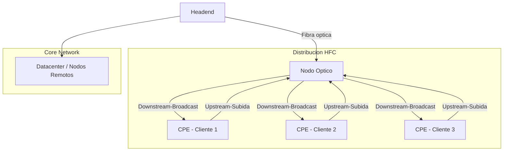
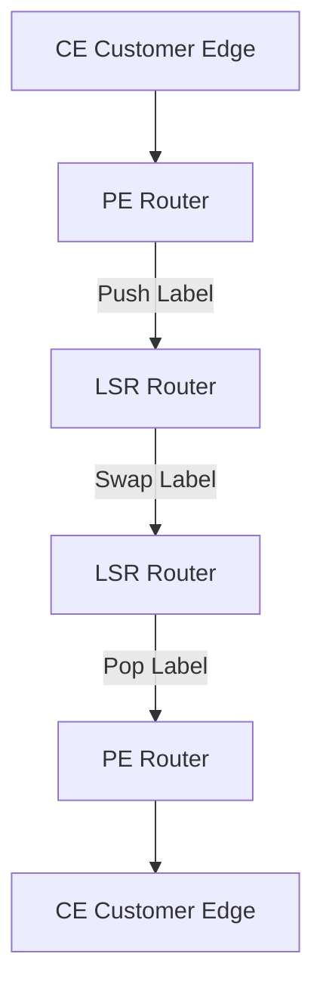
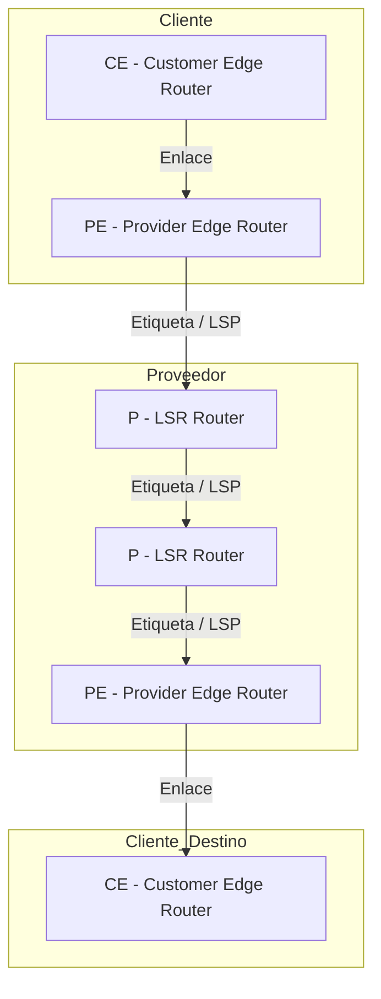
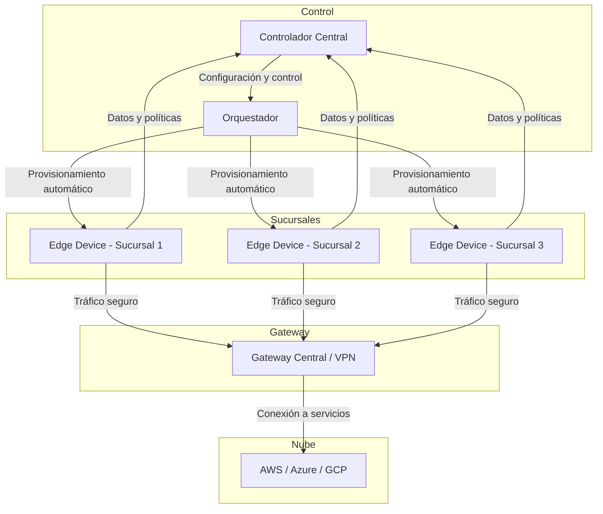

# Exposiciones Infraestructura TIC
> **Introducción a la Sección:**  
> Esta sección presenta los contenidos principales de la exposición, incluyendo conceptos, tecnologías y aplicaciones.  
> Los detalles pueden desplegarse haciendo clic en la flecha a la izquierda del título.

<details>
  <summary> HFC (Hybrid Fiber-Coaxial)</summary>


## 1era Exposición: HFC

### Introducción

- **HFC (Hybrid Fiber-Coaxial)**: Red de acceso utilizada por operadores de cable que combina fibra óptica y cable coaxial.  
- Inicialmente, las redes de televisión por cable utilizaban **coaxial**. Con la llegada de la **fibra óptica**, la arquitectura HFC mejoró notablemente.  
- La **fibra óptica** transporta señales digitales, permitiendo ofrecer servicios de **internet, televisión digital y telefonía IP**.

### Aplicaciones

- Televisión por cable  
- Internet  
- Telefonía  
- Servicios empresariales  

### Acceso al medio

- Evita colisiones usando **scheduler en Capa 2**.  
- Soporta **QoS real** mediante service flows con prioridad para voz y datos.  

---

## Fundamentos técnicos

- HFC es un **sistema híbrido** que llega hasta un **nodo óptico**, el cual convierte señales ópticas a radiofrecuencia y viceversa.  
- La **Capa 2 (Enlace de datos)** regula las reglas para transmitir y recibir datos, controlando errores y acceso al medio.  
- El tráfico tiene **subidas y bajadas**, como una carretera bidireccional:  
  - **Downstream**: Broadcast hacia los clientes, cada módem filtra la señal correspondiente.  
  - **Upstream**: Cada cliente envía información al nodo óptico.  

### Tipos de señales en HFC

- Óptica digital  
- Red eléctrica (analógica)  
- RF digital (modulación digital en radiofrecuencia)  

### Tramas DOCSIS

- Controlan la **comunicación** en la red, regulando acceso, prioridad y estructura de datos.  

---

## Arquitectura de la red HFC

- Combina **fibra óptica** (transporte de datos) y **cables coaxiales** (distribución final).  
- Permite que los usuarios puedan **enviar y recibir información** de forma eficiente.  
- Controla **errores** y el acceso al medio en Capa 2.  

### Componentes principales

1. **Headend**: Genera y encapsula los datos.  
2. **Fibra óptica de transporte**: Lleva la información desde el headend hasta el nodo óptico.  
3. **Nodo óptico**: Convierte señales ópticas en eléctricas y viceversa.  
4. **Red coaxial de distribución**: Transporta las tramas DOCSIS entre el nodo y los usuarios.  
5. **Equipos del cliente (CPE)**: Modems y terminales que reciben y envían información.  

---

## Interconexión y estándar DOCSIS

- Garantiza que las **tramas se transmitan de forma ordenada, sin colisiones** y con QoS.  
- Estructura las tramas **Ethernet**.  
- Controla el acceso al medio (**MAC**) y asigna ancho de banda en la red coaxial compartida.  

---

## Funcionamiento y transmisión de señales

- La combinación **fibra óptica + coaxial** permite alta velocidad, gran cobertura y aprovechamiento de la infraestructura existente.  
- La **Capa 2** regula:  
  - Acceso al medio  
  - Direccionamiento  
  - Corrección de errores  
- Garantiza la **integridad de la transmisión**.  

### Core network

- Dirige el tráfico al **datacenter** y a los **nodos remotos** para el acceso a los usuarios.  

### Canales de transmisión

- **Upstream (subida)**: Cada cliente envía datos en intervalos de tiempo controlados para evitar colisiones.  
  - Desafíos: mayor ruido, interferencias, sincronización y ajuste de potencia.  
- **Downstream (bajada)**: Broadcast hacia todos los clientes.  
  - Incluye direccionamiento MAC y cifrado individual por usuario.  

---

## Ventajas de HFC

1. Combina fibra óptica y coaxial, ofreciendo **alta capacidad** y **conexión final sencilla**.  
2. Infraestructura **madura y probada**, usada durante décadas.  
3. Permite **aprovechar redes coaxiales existentes**, reduciendo costos de instalación.  
4. **Relación costo-beneficio favorable**.  

## Limitaciones de HFC

1. **Ancho de banda asimétrico**: altas velocidades de descarga, pero bajas de subida.  
2. **Sensibilidad al ruido** e interferencias electromagnéticas debido al coaxial.  
3. **Mantenimiento constante**: el coaxial se degrada con el tiempo.  
4. Aunque la instalación es económica, los **costos operativos pueden ser altos**.  
## Gráfico en Mermaid

## Gráfico en Mermaid


## Conclusión

La red **HFC (Hybrid Fiber-Coaxial)** combina lo mejor de la **fibra óptica** y el **cable coaxial**, permitiendo a los operadores ofrecer servicios de **televisión digital, internet y telefonía IP** con alta velocidad y cobertura amplia.  

Gracias a la **Capa 2 (Enlace de Datos)** y al estándar **DOCSIS**, la red garantiza **control de errores, acceso ordenado al medio y calidad de servicio (QoS)**, optimizando tanto el downstream como el upstream.  

Entre sus ventajas destacan la **madurez de la infraestructura**, la **capacidad de aprovechar redes existentes** y la **buena relación costo-beneficio**. Sin embargo, presenta limitaciones como **ancho de banda asimétrico**, **sensibilidad al ruido** y **mantenimiento constante del coaxial**.  

En definitiva, HFC representa una **solución híbrida eficiente** que equilibra **rendimiento, cobertura y costos**, siendo una tecnología confiable para los servicios de acceso a Internet y transmisión de datos actuales.

</details>

<details>
  <summary>FTTH – Fibra Óptica hasta el Hogar</summary>

## Introducción a FTTH
- **FTTH (Fiber To The Home)**: Red que lleva fibra óptica directamente hasta el hogar del usuario final.  
- Características principales:  
  - **Alta velocidad** de transmisión de datos.  
  - **Baja latencia**, ideal para aplicaciones críticas como telemedicina y videojuegos.  
  - **Alta confiabilidad**, con mínima interferencia electromagnética.  
  - **Estabilidad** superior a las redes de cobre o híbridas HFC.  

### Contexto histórico
- **Años 90:** Redes de cobre tradicionales; limitadas para tráfico de datos alto.  
- **Años 2000:** HFC (Hybrid Fiber-Coaxial) mejora la capacidad, pero sigue limitada en velocidad de subida y simetría.  
- **Desde 2010:** Adopción global de **redes ópticas pasivas (PON)**, marcando el inicio de FTTH masivo.  
- **Actualidad:** FTTH es la infraestructura base de la conectividad de alta velocidad en hogares y empresas.  

### Razón de ser
- Responde al **crecimiento exponencial de la demanda de Internet**, video bajo demanda, teletrabajo y servicios de cloud.  
- La **fibra óptica** supera las limitaciones de cobre, ofreciendo mayor confiabilidad y eficiencia energética.  

---

## Funcionamiento de una red FTTH

- La fibra óptica llega **directamente desde la central hasta el hogar**, sin equipos eléctricos intermedios, lo que se denomina **red óptica pasiva (PON)**.  
- La señal viaja mediante **pulsos de luz**, lo que permite transmitir grandes volúmenes de datos con baja pérdida.  

### Recorrido de la señal
1. **OLT (Optical Line Terminal)** – Central de la operadora:  
   - Envía la señal óptica y gestiona su distribución a todos los usuarios.  
2. **ODN (Optical Distribution Network)** – Red de distribución pasiva:  
   - Incluye fibras, splitters, conectores y empalmes que permiten dividir la señal hacia múltiples usuarios.  
3. **ONT / ONU (Optical Network Terminal / Unit)** – Usuario final:  
   - Convierte la señal óptica en eléctrica para que los dispositivos del hogar puedan usarla.  

### Flujos de datos
- **Downstream (de central a usuarios):** Señal óptica dividida por splitters, llegando a cada ONT.  
- **Upstream (de usuarios a central):** Cada ONT envía datos al OLT respetando tiempos y sincronización para evitar colisiones.
- ## Gráfico FTTH en Mermaid

```mermaid
graph TD
    A[OLT - Optical Line Terminal] -->|Fibra óptica| B[ODN - Optical Distribution Network]

    subgraph Distribución PON
        B -->|Downstream| C[ONT - Cliente 1]
        B -->|Downstream| D[ONT - Cliente 2]
        B -->|Downstream| E[ONT - Cliente 3]

        C -->|Upstream| B
        D -->|Upstream| B
        E -->|Upstream| B
    end
 ```

---

## Componentes principales

| Componente | Función |
|------------|---------|
| **OLT (Optical Line Terminal)** | Envía, controla y gestiona la señal óptica. Ubicado en la central. |
| **ODN (Optical Distribution Network)** | Red pasiva que distribuye la señal a varios usuarios mediante splitters y fibras. |
| **ONT / ONU** | Convierte señal óptica en eléctrica; proporciona conectividad en el hogar. |
| **Splitters** | Dividen la señal óptica para múltiples usuarios sin necesidad de alimentación eléctrica. |
| **Fibra óptica** | Medio de transmisión de alta capacidad, baja latencia y mínima pérdida. |

---

## Organismos internacionales y estándares

- **ITU-T:** Define estándares y recomendaciones globales de redes ópticas.  
- **IEEE:** Mejora la interoperabilidad y adopción de nuevas tecnologías PON.  
- **Estándares PON principales:**  
  - **GPON:** 2.5 Gbps downstream / 1.25 Gbps upstream  
  - **XG-PON:** 10 Gbps downstream / 2.5 Gbps upstream  
  - **XGS-PON:** 10 Gbps simétrico  
  - **25G-PON y 50G-PON:** Futuras generaciones para mayor tráfico y usuarios  

---

## Evolución tecnológica y coexistencia

- Permite coexistir con **HFC y redes legacy de cobre**, asegurando compatibilidad con infraestructura existente.  
- Soporta aplicaciones modernas:  
  - **5G y IoT**  
  - **Telemedicina y educación remota**  
  - **Smart Cities** y servicios urbanos inteligentes  

### Ventajas de la evolución PON
- Mayor capacidad y simetría en la transmisión.  
- Soporte para **nuevas aplicaciones** sin necesidad de reemplazar toda la infraestructura.  
- Escalabilidad para aumentar la cobertura y usuarios conectados.  

---

## Diseño e impacto económico de FTTH

### Factores técnicos
- **Alcance de la red:** Distancia máxima entre OLT y ONT.  
- **Split ratio:** Número de usuarios por splitter (ej. 1:32 o 1:64).  
- **Pérdidas ópticas:** Por fibra, conectores, empalmes y splitters.  

### Costos
- **CAPEX:** Inversión inicial por usuario (~600 USD por hogar).  
- **OPEX:** Costos operativos de mantenimiento y monitoreo.  
- **TCO:** Costo total durante la vida útil de la red.  

### Ejemplo económico
- Una sola fibra puede atender hasta **32 hogares**.  
- Margen mensual promedio por usuario: **~12 USD**.  
- Beneficios: **alta durabilidad** y **menor tasa de fallas** que redes coaxiales.  

---

## Tendencias futuras

- **25G-PON:** Sucesor de XGS-PON, permite transportar más tráfico a hogares y empresas.  
- **50G-PON:** Próxima generación, con mayor capacidad de downstream y upstream.  
- **FTTH seguirá siendo la base de la infraestructura digital**, soportando el crecimiento del tráfico de datos, IoT, 5G y servicios inteligentes.  

---

## Conclusión
FTTH representa la **evolución definitiva de las redes de acceso**:  

- Alta velocidad, baja latencia y confiabilidad superior.  
- Diseño pasivo que reduce costos de operación y mantenimiento.  
- Escalable y compatible con futuras tecnologías como **5G, IoT y smart cities**.  
- Económicamente rentable y sostenible a largo plazo, con beneficios tanto para operadores como usuarios.  

FTTH no solo resuelve las limitaciones de las redes antiguas, sino que se posiciona como la **infraestructura del futuro digital**, capaz de soportar la creciente demanda de tráfico de datos a nivel global.

</details>


<details>
  <summary>Metro Ethernet – Infraestructura, Protocolos y Evolución</summary>

## Objetivos
- Analizar los **fundamentos de Metro Ethernet (ME)**.  
- Entender los **servicios y protocolos utilizados** en redes metropolitanas.  
- Identificar la **evolución y futuro de Metro Ethernet** en aplicaciones urbanas y empresariales.  

---

## Fundamentos de Metro Ethernet
- **Metro Ethernet (ME):** Tecnología que permite **transportar tráfico de datos de manera eficiente en un área metropolitana (MAN)**.  
- Nació para **extender redes LAN** a nivel urbano y reemplazar tecnologías heredadas (como ATM o Frame Relay).  
- Principios básicos de la **Capa 2 (Enlace de Datos, OSI)**:  
  - **Direccionamiento físico (MAC)**  
  - **Encapsulación de tramas**  
  - **Detección y corrección de errores**  
  - **Control de flujo** (IEEE 802.3x)  
  - Garantiza **transmisión confiable** dentro del dominio de enlace sin involucrar enrutamiento.  

---

## Arquitectura y estandarización (MEF)
- **MEF (Metro Ethernet Forum):** Organismo que define estándares y acuerdos de nivel de servicio (**SLA**) para garantizar interoperabilidad.  
- **Tipos de servicios definidos por MEF:**  
  - **E-Line (P2P):** Punto a punto, ideal para conexiones dedicadas.  
  - **E-Tree (P2MP):** Punto a multipunto, útil para aplicaciones de distribución.  
  - **E-LAN (MP2MP):** Multipunto a multipunto, permite comunicación entre varias oficinas.  
- **Componentes y actores:**  
  - **Suscriptor / Cliente**  
  - **Service Provider (SP / Operador)**  
  - **Operator:** Gestiona la infraestructura  
- **Interfaces estandarizadas:**  
  - **UNI (User-Network Interface):** Frontera cliente-proveedor  
  - **ENNI (External Network-to-Network Interface):** Interconexión entre operadores  
- **Conexiones lógicas:**  
  - **EVC (Ethernet Virtual Connection):** Conexión virtual entre puntos finales  
  - **OVC (Operator Virtual Connection):** Conexión virtual entre operadores  

## Gráfico Metro Ethernet en Mermaid

```mermaid
graph TD
    subgraph Cliente
        A[Cliente / Suscriptor] -->|UNI| B[EVC - Ethernet Virtual Connection]
    end

    subgraph Proveedor
        B --> C[Service Provider / Operador]
        C -->|ENNI| D[Otro Operador]
    end

    subgraph Red
        B -.->|VLAN Interna| A
        C -.->|VLAN Externa| D
    end

    subgraph Protocolos
        B --> E[OAM - Supervisión y Mantenimiento]
        B --> F[QoS - Priorización de tráfico]
        B --> G[PBB - Encapsulamiento de tramas]
    end
```
---

## Protocolos y mecanismos esenciales
- **VLANs (Virtual LANs):**  
  - Dividen la red física en redes virtuales, aislando tráfico de clientes.  
  - Permiten al proveedor transportar múltiples VLANs sobre la misma infraestructura.  
- **E-LMI (Ethernet Local Management Interface):**  
  - Gestiona conectividad entre cliente y proveedor sin necesidad de asignar IP.  
- **ERPS (Ethernet Ring Protection Switching):**  
  - Garantiza resiliencia en topologías en anillo, minimizando tiempo de recuperación ante fallos.  
- **OAM (Operations, Administration, Maintenance):**  
  - Supervisión, administración y mantenimiento de la red para asegurar disponibilidad y rendimiento.  
- **PBB (Provider Backbone Bridges):**  
  - Encapsula tramas de cliente para transporte eficiente en la red del proveedor.  
- **QoS (Quality of Service):**  
  - Priorización de tráfico crítico (voz, video, datos sensibles) y gestión de congestión.  
- **Seguridad:**  
  - Segmentación de tráfico mediante VLANs.  
  - Control de acceso en interfaces UNI/ENNI.  
  - Monitoreo constante mediante OAM y ERPS.  

---

## Coexistencia y ejemplos prácticos
- **Coexistencia con HFC y redes legacy de cobre**: Posibilidad de migrar servicios sin interrumpir clientes existentes.  
- **Aplicaciones típicas:**  
  - Interconexión de **oficinas corporativas** en la ciudad.  
  - **Backhaul de 5G** y enlaces de alta velocidad para ISPs.  
  - Redes de **telecomunicaciones metropolitanas** reemplazando antiguos enlaces de cobre o ATM.  

---

## Diseño y consideraciones técnicas
- **Factores clave en diseño de ME:**  
  - Alcance de la red y densidad de usuarios.  
  - **Topologías:** Anillo, estrella o malla según resiliencia deseada.  
  - **Split ratio y capacidad de enlaces:** Evita congestión y asegura QoS.  
  - Pérdidas por fibras, conectores y empalmes.  
- **Costos:**  
  - **CAPEX:** Equipamiento y despliegue inicial  
  - **OPEX:** Mantenimiento y operación continua  
  - **TCO:** Costo total a lo largo de la vida útil  

---

## Limitaciones técnicas
- Dependencia de la **capa 2**: Servicios complejos requieren encapsulación adicional.  
- Requiere **equipos especializados y monitoreo constante**.  
- Gestión de VLANs y QoS crítica para evitar **congestión y colisiones**.  

---

## Evolución y tendencias futuras
- **Migración hacia Carrier Ethernet avanzado:** Mayor velocidad y capacidad de gestión.  
- **MEF 3.0 y 4.0:** Integración con servicios basados en nube, virtualización y automatización.  
- **Soporte para 5G y servicios IoT:** Backhaul eficiente para células urbanas.  
- **Seguridad mejorada:** Monitoreo proactivo y segmentación dinámica de tráfico.  
- **Redes SDN (Software Defined Networking):** Permite control programable de Metro Ethernet para optimizar tráfico y recursos.  
- **Integración con FTTH y PON:** Redes híbridas que combinan Metro Ethernet para transporte y FTTH para acceso residencial.  

---

## Ventajas
- Escalable y flexible para crecer con la ciudad.  
- Alta velocidad y confiabilidad para aplicaciones críticas.  
- Compatibilidad con infraestructura existente y futuras tecnologías.  
- Permite **QoS y segmentación de tráfico** avanzada.  

## Conclusión
Metro Ethernet es **una infraestructura eficiente y confiable** para transporte de datos en áreas metropolitanas:  

- Facilita la **expansión de servicios Ethernet** más allá de LANs tradicionales.  
- Permite **resiliencia, segmentación y QoS**, esenciales para aplicaciones empresariales y servicios críticos.  
- Evoluciona hacia redes **inteligentes, SDN y Carrier Ethernet**, adaptándose a la demanda creciente de conectividad urbana.  
- Su adopción sigue siendo estratégica para operadores que requieren **alta capacidad, flexibilidad y eficiencia económica**.

</details>


<details>
  <summary>MPLS – Multi-Protocol Label Switching</summary>

## Introducción a MPLS
- **MPLS (Multi-Protocol Label Switching):** Tecnología de **conmutación y encaminamiento** usada en redes WAN para optimizar el transporte de datos.  
- Sustituye el uso exclusivo de direcciones IP, usando **etiquetas (labels)** para mejorar la eficiencia y velocidad del tráfico.  
- Se considera una **capa 2.5 del modelo OSI**, combinando características de capa de enlace de datos y capa de red.  
- Permite **enrutamiento rápido basado en etiquetas** y transporte de protocolos distintos sobre la misma red.  

---

## Fundamentos de una red MPLS
- MPLS es una **técnica de conmutación y encaminamiento** que asigna rutas predefinidas para optimizar el envío de paquetes entre nodos.  
- Cada paquete se clasifica en una **FEC (Forwarding Equivalence Class)** y se le asigna una etiqueta (label) que actúa como instrucción para el tránsito rápido.  
- **Encabezado MPLS:**  
  - Longitud: 4 bytes  
  - Ubicado **entre el encabezado de Capa 2 y Capa 3**.  

### Componentes de la etiqueta MPLS
- **Label:** Identifica la FEC o clase de paquete.  
- **Swap:** Intercambia etiquetas entre routers internos.  
- **Push:** Inserta una etiqueta nueva en la pila.  
- **Pop:** Elimina la etiqueta cuando el paquete sale de la red MPLS.  
- **S bit (Bottom of Stack):** Indica si la etiqueta es la última de la pila.  
- **TTL (Time To Live):** Evita bucles; decrementa en 1 por salto y descarta el paquete si llega a 0.  

---


## Funcionamiento básico
### Tipos de routers
- **LER (Label Edge Router):** Operan en el borde de la red; analizan los paquetes entrantes y asignan etiquetas.  
- **LSR (Label Switching Router):** Routers internos que solo consultan la etiqueta para reenviar paquetes según tablas MPLS.  
- **LSP (Label Switched Path):** Caminos predefinidos por los que transitan los paquetes dentro de la red.  

### Clasificación y FEC
- La **FEC** determina cómo se agrupan los paquetes con características similares.  
- Cada router consulta la **tabla de etiquetas** y realiza la acción correspondiente (swap, push o pop).  

### Pila de etiquetas
- Permite manejar múltiples labels, por ejemplo:  
  - **Top Label:** Indica ruta principal.  
  - **VC Label:** Usada para L2VPN y servicios específicos.  

---

## Protocolos asociados
- **Interior Gateway Protocols (IGP):** Intercambian información de rutas internas (OSPF, IS-IS).  
- **Label Distribution Protocol (LDP):**  
  - Asigna etiquetas a cada router para llegar a un destino.  
  - Garantiza que cada LER y LSR conozca las rutas etiquetadas.  
- **Resource Reservation Protocol (RSVP-TE):**  
  - Distribuye etiquetas y reserva ancho de banda para garantizar QoS.  
- **BGP:**  
  - Intercambia rutas entre proveedores y permite interconexión de múltiples sedes de manera virtual y segura.  

---

## Topología y funcionamiento de la red
- **CE (Customer Edge):** Router del cliente.  
- **PE (Provider Edge):** LER que conecta la red del proveedor con el cliente.  
- **P (Provider):** LSR que transporta el tráfico entre PEs sin analizar IP, solo etiquetas.  

- Flujo típico:  
  CE → PE (LER) → P (LSR) → PE (LER) → CE  


---

## Casos de uso y aplicaciones prácticas
- **Conexión de sedes empresariales:** L2VPN mediante **VPLS (Virtual Private LAN Service)** o **VPWS (Virtual Private Wire Service)**.  
- **Calidad de Servicio (QoS) y Traffic Engineering (TE):** Garantiza ancho de banda para servicios críticos.  
- **Sustitución de redes heredadas:** Telmex, Telecom y otros operadores migran de Frame Relay o ATM a MPLS.  
- **Empresas multinacionales:** Conexión segura y eficiente de múltiples oficinas y data centers.  

---

## Limitaciones del MPLS
- Dependencia de **equipos compatibles** con funciones de borde (PE) y tránsito (P).  
- Requiere **planificación cuidadosa de LSP, VPLS, VPWS y QoS**.  
- Gestión de **MTU (Maximum Transmission Unit)** y supervisión constante mediante **OAM**.  
- No elimina la necesidad de protocolos de capa 3; requiere integración con IGP y BGP.  

---

## Evolución y tendencias futuras
- Integración con **SD-WAN:** MPLS se complementa con redes definidas por software para optimizar rutas y costos.  
- **Automatización de redes y orquestación:** Mejora la eficiencia operativa y reduce errores humanos.  
- Mayor adopción de **L2VPN y L3VPN híbridas** para servicios empresariales y cloud.  
- **Soporte para 5G y IoT:** MPLS sigue siendo base para backhaul y transporte confiable de alto volumen de datos.  
- Evolución hacia **MPLS-TP (Transport Profile):** MPLS para transporte con nivel de confiabilidad similar a redes ópticas.  

---

## Conclusión
MPLS es una tecnología **clave en redes WAN**, que combina eficiencia, velocidad y flexibilidad:  

- Optimiza el transporte de datos mediante etiquetas en lugar de depender solo de IP.  
- Permite implementar **VPNs empresariales seguras** y garantizar QoS.  
- Su arquitectura flexible (LER, LSR, LSP) permite adaptarse a diferentes aplicaciones y topologías.  
- Evoluciona constantemente, integrándose con **SD-WAN, 5G y servicios en la nube**, consolidándose como infraestructura crítica para proveedores y grandes empresas.  

</details>

<details>
  <summary>SD-WAN – Software Defined Wide Area Network</summary>

## Conceptualización SD-WAN
- **SD-WAN (Software Defined Wide Area Network):** Red de área amplia gestionada mediante **software**, que permite centralizar la administración de la red sin necesidad de configurar routers localmente.  
- **Objetivos principales:**  
  - Priorizar automáticamente aplicaciones críticas (por ejemplo, videollamadas o aplicaciones empresariales).  
  - Reducir costos utilizando Internet seguro junto con enlaces MPLS.  
  - Mejorar rendimiento mediante **selección dinámica de rutas**.  
- **Beneficios clave:** Flexibilidad, eficiencia y control centralizado sobre la red empresarial.

---

## Arquitectura
- **Función principal:** Conectar sedes, centros de datos y aplicaciones en la nube.  
- **Separación de planos:**  
  - **Plano de control:** Toma decisiones de enrutamiento y políticas de tráfico.  
  - **Plano de datos:** Transporte físico de la información entre dispositivos y sedes.  
  - **Plano de gestión:** Configuración, monitoreo y administración centralizada.  
- Permite gestionar tráfico y priorizar aplicaciones desde un panel central, sin intervención local en cada sucursal.

---

## Estructura funcional
1. **Controlador central:**  
   - “Cerebro” de la SD-WAN, centraliza información de la red y toma decisiones de enrutamiento y políticas.  
   - Evita la necesidad de configurar cada sucursal manualmente.  
2. **Orquestador:**  
   - Automatiza la implementación de la red SD-WAN.  
   - Permite **provisionamiento automático** en sucursales cuando se conectan por primera vez a Internet.  
   - Panel centralizado para administración de múltiples sitios.  
3. **Edge Devices:**  
   - Dispositivos ubicados en cada sucursal.  
   - Actúan como entrada y salida de datos, asegurando conectividad segura y gestión del tráfico.  
4. **Gateways:**  
   - Equipos centrales para enrutamiento y acceso a recursos compartidos o la nube.  

---

## Ubicación de la implementación
- **En las instalaciones (On-Premises):** Mayor control y seguridad.  
- **En la nube o entorno multinube:** Conexión con servicios como AWS, Azure o GCP.  
- **Híbrida:** Combinación de infraestructura local y servicios en la nube.  

---

## Tipos de implementación
- **DIY (Do It Yourself):** La empresa implementa y gestiona la SD-WAN internamente.  
- **Administrada:** Proveedor externo gestiona toda la red SD-WAN.  
- **Co-administrada:** Gestión compartida entre empresa y proveedor.  

---

## Tipos de arquitectura según el dispositivo
- **Físico:** Equipo de hardware instalado en sedes o centros de datos.  
- **Virtual:** Software SD-WAN ejecutado sobre hardware existente o máquinas virtuales.  
- **En la nube:** Servicio alojado y gestionado por el proveedor, accesible desde cualquier ubicación.  

---

## Características principales
- Gestión centralizada y panel único para administrar toda la red.  
- Compatibilidad con múltiples tipos de conexión (MPLS, Internet, LTE/5G).  
- Inteligencia en el enrutamiento para seleccionar la mejor ruta según aplicación y disponibilidad.  
- Seguridad integrada, incluyendo cifrado de tráfico y segmentación de red.  
- Escalabilidad y provisión automática en nuevas sucursales.  

---

## Ventajas
- Red más flexible y eficiente.  
- Reducción de costos operativos y de infraestructura.  
- Mejora del rendimiento de aplicaciones críticas.  
- Despliegue rápido de nuevas sedes o enlaces.  
- Monitoreo y gestión centralizados.  

---

## Desventajas
- Dependencia de un **controlador y orquestador centralizados**: fallo puede afectar toda la red.  
- Requiere **compatibilidad del hardware existente**.  
- Curva de aprendizaje para administrar políticas y rutas avanzadas.  
- Seguridad depende del cifrado y segmentación correcta; errores pueden generar vulnerabilidades.  

---
## Comparación WAN Tradicional vs SD-WAN

| Característica                     | WAN Tradicional                               | SD-WAN                                         |
|-----------------------------------|-----------------------------------------------|------------------------------------------------|
| **Gestión**                        | Configuración manual en cada router          | Centralizada mediante software (controlador) |
| **Flexibilidad**                    | Difícil de adaptar y escalar                  | Fácil de escalar y agregar nuevas sucursales  |
| **Rutas y enrutamiento**            | Estático o limitado a protocolos IGP/BGP     | Dinámico, selección de rutas según desempeño y prioridad de aplicaciones |
| **Prioridad de aplicaciones**       | Limitada, requiere configuración compleja    | Automática, se pueden priorizar videollamadas, VoIP o ERP |
| **Costo**                           | Alto, requiere enlaces dedicados (MPLS)      | Menor, puede usar Internet seguro + MPLS      |
| **Visibilidad y monitoreo**         | Limitada, requiere herramientas adicionales  | Completa, centralizada en tiempo real        |
| **Seguridad**                        | VPN tradicional, segmentación limitada       | Integrada, cifrado de tráfico y segmentación por políticas |
| **Implementación de nuevas sedes** | Lenta y manual                                | Rápida, automatizada mediante orquestador    |
| **Adaptación a la nube**           | Difícil de integrar con AWS, Azure o GCP     | Nativa, optimiza acceso a servicios cloud    |
| **Mantenimiento**                    | Costoso y dependiente de personal local      | Más eficiente, centralizado y automatizado   |

## Futuro y tendencias
- Integración con **SD-Branch:** Expansión de SD-WAN a redes de sucursales completas, incluyendo Wi-Fi y seguridad.  
- Compatibilidad con **5G y LTE** para mejorar conectividad remota.  
- Automatización avanzada mediante **inteligencia artificial** para optimizar tráfico y detectar anomalías.  
- Mayor adopción de **nube híbrida y multinube**, facilitando acceso a servicios SaaS y centros de datos globales.  
- Convergencia con **SASE (Secure Access Service Edge)**: integración de seguridad y red en un solo servicio.  

</details>
