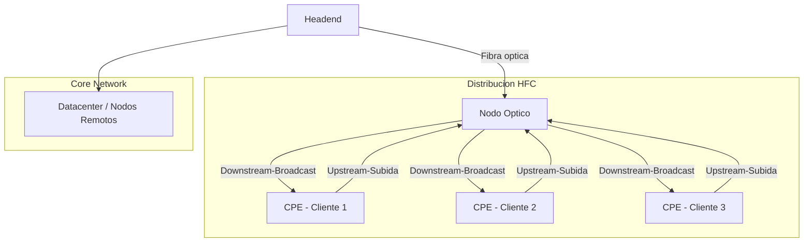

## 1era Exposición: HFC

### Introducción

- **HFC (Hybrid Fiber-Coaxial)**: Red de acceso utilizada por operadores de cable que combina fibra óptica y cable coaxial.  
- Inicialmente, las redes de televisión por cable utilizaban **coaxial**. Con la llegada de la **fibra óptica**, la arquitectura HFC mejoró notablemente.  
- La **fibra óptica** transporta señales digitales, permitiendo ofrecer servicios de **internet, televisión digital y telefonía IP**.

### Aplicaciones

- Televisión por cable  
- Internet  
- Telefonía  
- Servicios empresariales  

### Acceso al medio

- Evita colisiones usando **scheduler en Capa 2**.  
- Soporta **QoS real** mediante service flows con prioridad para voz y datos.  

---

## Fundamentos técnicos

- HFC es un **sistema híbrido** que llega hasta un **nodo óptico**, el cual convierte señales ópticas a radiofrecuencia y viceversa.  
- La **Capa 2 (Enlace de datos)** regula las reglas para transmitir y recibir datos, controlando errores y acceso al medio.  
- El tráfico tiene **subidas y bajadas**, como una carretera bidireccional:  
  - **Downstream**: Broadcast hacia los clientes, cada módem filtra la señal correspondiente.  
  - **Upstream**: Cada cliente envía información al nodo óptico.  

### Tipos de señales en HFC

- Óptica digital  
- Red eléctrica (analógica)  
- RF digital (modulación digital en radiofrecuencia)  

### Tramas DOCSIS

- Controlan la **comunicación** en la red, regulando acceso, prioridad y estructura de datos.  

---

## Arquitectura de la red HFC

- Combina **fibra óptica** (transporte de datos) y **cables coaxiales** (distribución final).  
- Permite que los usuarios puedan **enviar y recibir información** de forma eficiente.  
- Controla **errores** y el acceso al medio en Capa 2.  

### Componentes principales

1. **Headend**: Genera y encapsula los datos.  
2. **Fibra óptica de transporte**: Lleva la información desde el headend hasta el nodo óptico.  
3. **Nodo óptico**: Convierte señales ópticas en eléctricas y viceversa.  
4. **Red coaxial de distribución**: Transporta las tramas DOCSIS entre el nodo y los usuarios.  
5. **Equipos del cliente (CPE)**: Modems y terminales que reciben y envían información.  

---

## Interconexión y estándar DOCSIS

- Garantiza que las **tramas se transmitan de forma ordenada, sin colisiones** y con QoS.  
- Estructura las tramas **Ethernet**.  
- Controla el acceso al medio (**MAC**) y asigna ancho de banda en la red coaxial compartida.  

---

## Funcionamiento y transmisión de señales

- La combinación **fibra óptica + coaxial** permite alta velocidad, gran cobertura y aprovechamiento de la infraestructura existente.  
- La **Capa 2** regula:  
  - Acceso al medio  
  - Direccionamiento  
  - Corrección de errores  
- Garantiza la **integridad de la transmisión**.  

### Core network

- Dirige el tráfico al **datacenter** y a los **nodos remotos** para el acceso a los usuarios.  

### Canales de transmisión

- **Upstream (subida)**: Cada cliente envía datos en intervalos de tiempo controlados para evitar colisiones.  
  - Desafíos: mayor ruido, interferencias, sincronización y ajuste de potencia.  
- **Downstream (bajada)**: Broadcast hacia todos los clientes.  
  - Incluye direccionamiento MAC y cifrado individual por usuario.  

---

## Ventajas de HFC

1. Combina fibra óptica y coaxial, ofreciendo **alta capacidad** y **conexión final sencilla**.  
2. Infraestructura **madura y probada**, usada durante décadas.  
3. Permite **aprovechar redes coaxiales existentes**, reduciendo costos de instalación.  
4. **Relación costo-beneficio favorable**.  

## Limitaciones de HFC

1. **Ancho de banda asimétrico**: altas velocidades de descarga, pero bajas de subida.  
2. **Sensibilidad al ruido** e interferencias electromagnéticas debido al coaxial.  
3. **Mantenimiento constante**: el coaxial se degrada con el tiempo.  
4. Aunque la instalación es económica, los **costos operativos pueden ser altos**.  
## Gráfico en Mermaid

## Gráfico en Mermaid

## Conclusión

La red **HFC (Hybrid Fiber-Coaxial)** combina lo mejor de la **fibra óptica** y el **cable coaxial**, permitiendo a los operadores ofrecer servicios de **televisión digital, internet y telefonía IP** con alta velocidad y cobertura amplia.  

Gracias a la **Capa 2 (Enlace de Datos)** y al estándar **DOCSIS**, la red garantiza **control de errores, acceso ordenado al medio y calidad de servicio (QoS)**, optimizando tanto el downstream como el upstream.  

Entre sus ventajas destacan la **madurez de la infraestructura**, la **capacidad de aprovechar redes existentes** y la **buena relación costo-beneficio**. Sin embargo, presenta limitaciones como **ancho de banda asimétrico**, **sensibilidad al ruido** y **mantenimiento constante del coaxial**.  

En definitiva, HFC representa una **solución híbrida eficiente** que equilibra **rendimiento, cobertura y costos**, siendo una tecnología confiable para los servicios de acceso a Internet y transmisión de datos actuales.

