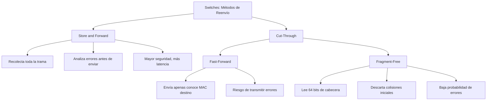
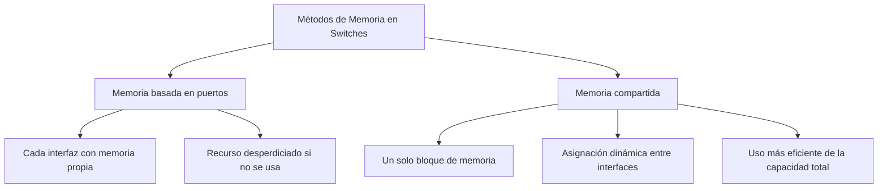
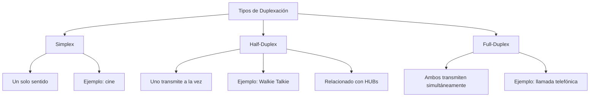
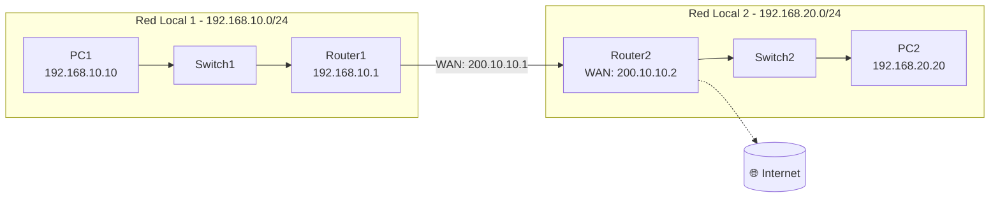
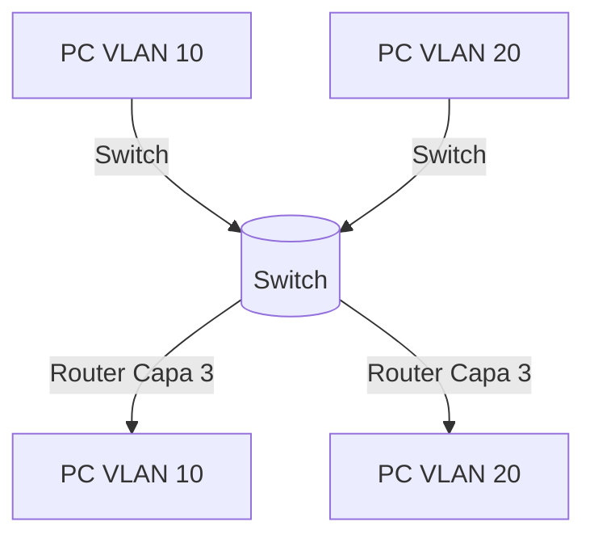
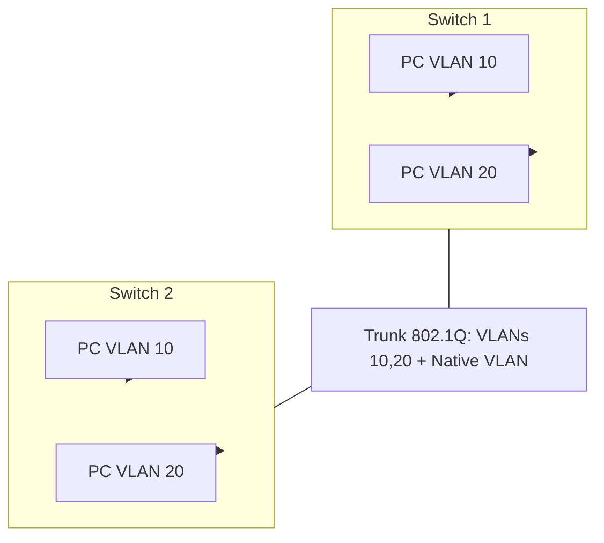

## Clase 3  
**29/09/2025**

### Switches de Capa 2  

Los switches de capa 3, aunque trabajan en capas 2 y 3, suelen ser **más costosos**.  
En este curso nos centraremos en la **capa de acceso**.  

---

### Capas de Red  
- **Core** → Backbone de la red.  
- **Distribución** → Interconexión entre acceso y core.  
- **Acceso** → Donde los usuarios finales se conectan (ej: switches de capa 2).  

La conectividad de los usuarios finales a la red de la universidad normalmente se realiza con **switches de capa 2**.  

---

### Métodos de Reenvío en Switches  

Los switches deben manejar el tráfico de los dispositivos conectados y para ello existen **dos grandes métodos de reenvío**:  

#### 1. Store and Forward  
- Recolecta **toda la trama** antes de enviarla.  
- Analiza errores antes de transmitir.  
- Tamaño típico: **1500 octetos**.  
- Más seguro (no envía tramas dañadas).  
- Mayor latencia en comparación con Cut-Through.  

#### 2. Cut-Through  
- Analiza solo una parte de la trama antes de reenviarla.  
- Más rápido, pero con riesgo de transmitir errores.  
- Dos variantes:  

  - **Fast-Forward**:  
    - Empieza a reenviar apenas conoce la dirección **MAC** de destino.  
    - Puede transmitir errores.  

  - **Fragment-Free**:  
    - Lee los primeros **64 bits** de la cabecera antes de reenviar.  
    - Descarta tramas con colisiones iniciales.  
    - Reduce la probabilidad de errores.  

---

### Diagrama en Mermaid  


## Métodos de Memoria en Switches  

La memoria utilizada depende del **fabricante** y del **modelo de switch**. Algunos implementan múltiples opciones:  

- **Memoria basada en puertos**  
  - Cada interfaz tiene su **propia memoria independiente**.  
  - Ejemplo: un servidor en una interfaz y PCs en otras → cada uno con su recurso de memoria.  
  - Si no se usa, el recurso se desperdicia.  

- **Memoria compartida**  
  - Existe un solo bloque de memoria compartido entre todas las interfaces.  
  - Los recursos se asignan dinámicamente según la necesidad.  
  - Mejora la eficiencia al aprovechar toda la capacidad de memoria.  



---

## Duplexación en la Comunicación  

La **duplexación** define la forma en que dos dispositivos pueden comunicarse:  

- **Simplex** → Solo un sentido. Ejemplo: ver una película en cine.  
- **Half-Duplex** → Solo uno transmite a la vez. Ejemplo: Walkie Talkie.  
- **Full-Duplex** → Ambos transmiten al mismo tiempo. Ejemplo: llamada telefónica.  

> Nota: Cuando una red opera en **Half-Duplex**, normalmente se utiliza un **HUB**.  



## Duplex and Speed Settings  

La **duplexación** es fundamental para evitar errores de comunicación entre dispositivos.  

- Si conectamos un dispositivo en **Full-Duplex** con otro en **Half-Duplex**, la comunicación se ajustará a la velocidad más lenta: **Half-Duplex**.  
- Esto puede generar **colisiones, pérdidas de paquetes o baja eficiencia**.  
- No todas estas configuraciones se aplican en la vida real, pues dependen de la **tecnología de red** utilizada (ej: switches modernos suelen forzar **Full-Duplex** en enlaces Gigabit).  

---

## Address Resolution Protocol (ARP)  

El **ARP (Address Resolution Protocol)** permite mapear direcciones **lógicas (IP)** a direcciones **físicas (MAC)** para que los dispositivos puedan comunicarse.  

- **Dirección Física (MAC):** Nivel de **capa 2 (enlace de datos)**, única para cada tarjeta de red.  
- **Dirección Lógica (IP):** Nivel de **capa 3 (red)**, necesaria para identificar dispositivos en una red.  

Para que dos dispositivos se comuniquen:  
1. Necesitan **direcciones IP**.  
2. ARP mantiene un registro que relaciona la **IP ↔ MAC**.  
3. En switches de capa 2:  
   - **No tienen IP propia** para transmitir datos.  
   - Solo tienen IP cuando es para **administración** (ej: acceso por consola o web).  

### Ejemplo de red local (IPv4)  
Supongamos tres dispositivos en la misma subred:  
- PC1 → `192.168.10.10`  
- PC2 → `192.168.10.20`  
- PC3 → `192.168.10.30`  
Todos deben tener dirección IP para comunicarse en esa LAN.  

---

## Comunicación en Red Remota  

Cuando el destino está en **otra red**, la dirección MAC de destino ya no es la del dispositivo remoto, sino la del **Default Gateway** (normalmente un router).  

---

### Diagrama de comunicación remota (ejemplo inventado)  



 En este escenario:  
- PC1 quiere comunicarse con PC2.  
- La **MAC de destino** de la trama que envía PC1 no es la de PC2, sino la del **Default Gateway (Router1)**.  
- Router1 se encarga de reenviar el tráfico hacia la red de destino.  


## ARP y RARP  

### ARP (Address Resolution Protocol)  
- Resuelve la **dirección MAC** de un dispositivo conociendo su **IP**.  
- Mantiene una **tabla ARP** que relaciona direcciones **IP ↔ MAC**.  
- Todo dispositivo necesita conocer la IP y la MAC de destino para comunicarse.  
- Ejemplo de uso:  
  ```cmd
  arp -a
  ```

Analogía:  
- Tengo el **nombre** de la persona (IP), pero necesito su **número telefónico** (MAC).  

---

### RARP (Reverse ARP)  
- Hace lo contrario: obtiene la **IP a partir de una dirección MAC**.  
- Fue utilizado antiguamente por dispositivos sin disco o con configuraciones mínimas.  
- Hoy en día se reemplaza por protocolos más modernos como **DHCP**.  

Analogía:  
- Tengo el **número telefónico** (MAC), pero no sé a quién pertenece (IP).  

---

### Ejemplo práctico en Windows  

Comando:  
```cmd
C:\Users\Administrator> arp -a
```

Salida simplificada:  

| Dirección de Internet | Dirección Física (MAC) | Tipo     |
|------------------------|------------------------|----------|
| 172.16.128.1          | 00-1b-17-00-01-40      | dinámico |
| 172.16.143.255        | ff-ff-ff-ff-ff-ff      | estático |
| 224.0.0.22            | 01-00-5e-00-00-16      | estático |
| 255.255.255.255       | ff-ff-ff-ff-ff-ff      | estático |

---

Comando para ver configuración de red:  
```cmd
C:\Users\Administrator> ipconfig
```

Salida simplificada:  

- **Adaptador Wi-Fi:**  
  - Dirección IPv4: `172.16.128.93`  
  - Máscara de subred: `255.255.240.0`  
  - Puerta de enlace predeterminada: `172.16.128.1`  

---

### Conclusión  
- ARP es fundamental para la comunicación en redes locales (LAN).  
- Cada vez que un dispositivo quiere comunicarse, revisa su tabla ARP para saber la **MAC** asociada a una **IP**.  
- Si no existe, el dispositivo envía una **consulta ARP broadcast** en la red.  


## VLAN (Virtual Local Area Network)

Una **VLAN** es una red lógica que se crea dentro de un switch físico.  
Permite segmentar la red en **grupos más pequeños** de dispositivos, aunque todos estén conectados al mismo switch físico.

### Características principales:
- **Segmentación lógica:** no importa la ubicación física del dispositivo.
- **Seguridad:** los dispositivos de diferentes VLAN no se comunican directamente sin un router o capa 3.
- **Optimización:** reduce el dominio de broadcast y mejora el rendimiento.
- **Flexibilidad:** un mismo switch puede soportar múltiples redes lógicas.

### Consideraciones:
- Si **no necesitas VLAN**, la red puede funcionar sin problemas, pero estarás en una **única VLAN por defecto** (generalmente la VLAN 1).
- Existen VLANs que **no se pueden borrar** (como la VLAN 1 en muchos fabricantes).
- Que una tecnología deje de ser actualizada **no significa que deje de existir**:  
  muchas redes todavía usan configuraciones antiguas porque siguen funcionando.

### Ejemplo gráfico en Mermaid

## VLANs y Enlaces Troncales

### VLAN Nativa
- La **VLAN nativa** se utiliza exclusivamente en enlaces **troncales (802.1Q)**.
- En un enlace troncal, **todas las tramas se etiquetan**, excepto las que pertenecen a la **VLAN nativa**.
- Sirve como una especie de "canal sin etiqueta".
- Por defecto suele ser la **VLAN 1**, aunque por seguridad se recomienda cambiarla.

---

### Enlaces Troncales (Trunk Links)
- Un **enlace troncal** permite que varias **VLANs viajen por un mismo enlace físico**.
- Se comporta como un **multiplexor de VLANs**:  
  combina múltiples VLAN en una sola conexión entre switches o entre switch–router.
- Estándar más común: **IEEE 802.1Q**.
- Los **trunks** se configuran principalmente entre:
  - **Switch ↔ Switch**
  - **Switch ↔ Router (Router-on-a-Stick)**
  - **Switch ↔ Servidores Virtualizados**

> Antes de los trunks, se necesitaban **varios enlaces físicos**, uno por VLAN.  
> Los enlaces troncales resolvieron ese problema al **unificar todas las VLAN en un único enlace físico**.

---

### Tipos de VLAN

1. **Data VLAN**  
   - Dedicada al tráfico generado por los usuarios.  
   - La **VLAN por defecto** (generalmente VLAN 1) es también una **Data VLAN**, ya que todos los puertos están asignados a ella inicialmente.  

2. **Native VLAN**  
   - Usada en enlaces troncales.  
   - Todas las tramas se etiquetan en un enlace troncal **excepto** las de la VLAN nativa.  
   - Se recomienda **no usar la VLAN 1** como nativa por seguridad.  

3. **Management VLAN**  
   - Utilizada para **administración remota** del switch (SSH, Telnet, SNMP).  
   - No debería mezclarse con el tráfico de usuarios.  
   - Normalmente corresponde a la VLAN configurada como **SVI (Switch Virtual Interface)** en un switch capa 2.  

---

### Ejemplo gráfico en Mermaid



## Voice VLAN

Las VLAN de voz (Voice VLAN) son un tipo especial de VLAN dedicada al tráfico de telefonía IP (VoIP).  
Se requiere una VLAN separada porque el tráfico de voz tiene necesidades muy específicas:

- **Ancho de banda garantizado** (assured bandwidth).  
- **Alta prioridad de QoS (Quality of Service)**, para que las llamadas no se vean interrumpidas.  
- **Capacidad de evitar congestión**.  
- **Baja latencia (<150 ms)** desde origen hasta destino, ya que cualquier retardo degrada la calidad de la llamada.

> La red completa debe estar diseñada para soportar voz: switches, routers, enlaces WAN y configuraciones de QoS.

### Características clave
- Una **Voice VLAN** no reemplaza a la VLAN de datos, sino que se configura **en paralelo**.  
- En una misma interfaz física del switch (ejemplo: FastEthernet 0/1) pueden coexistir:  
  - **Data VLAN** → para tráfico de usuarios (navegación, aplicaciones).  
  - **Voice VLAN** → para tráfico de teléfonos IP.  

### Ejemplo práctico
En entornos como universidades o empresas, donde se usa un **PBX/conmutador telefónico IP**, la misma interfaz del switch conecta un **PC y un teléfono IP**, y ambos son diferenciados gracias a la configuración de VLAN de voz.  

- El teléfono IP etiqueta su tráfico con la VLAN de voz.  
- El PC sigue transmitiendo sobre la VLAN de datos.  

De esta forma, aunque comparten el mismo puerto físico, **no son dos VLAN de la misma naturaleza**, sino una de voz y otra de datos.  
