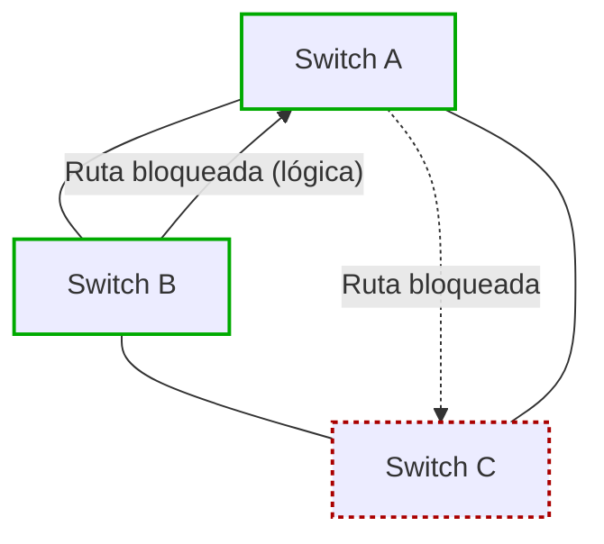
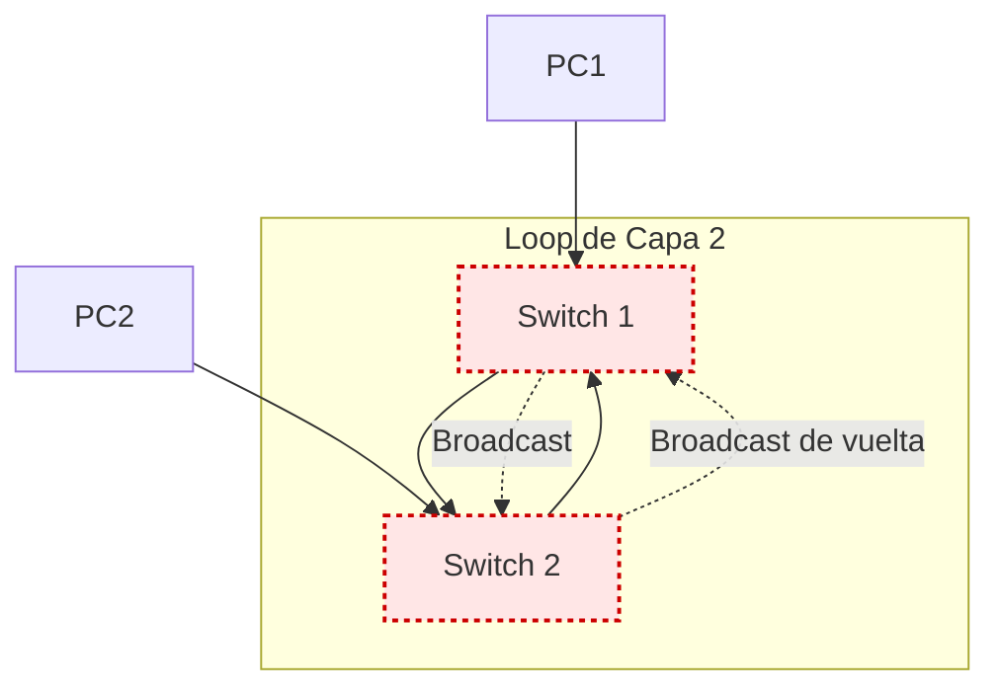
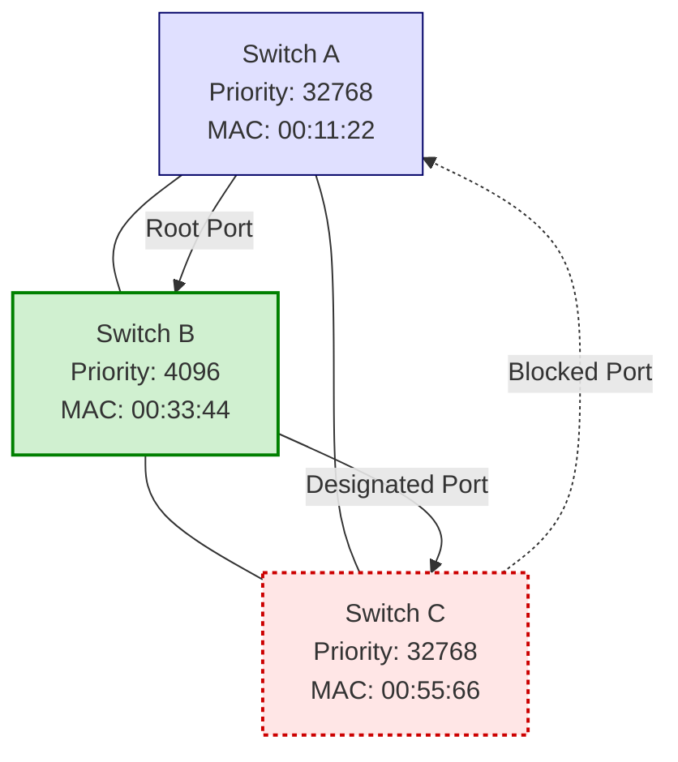

# Infraestructura - Clase 4  
## Spanning Tree Protocol (STP)

### Concepto general
El **Spanning Tree Protocol (STP)** es un protocolo de capa 2 que previene los bucles (loops) en redes con topologías redundantes.  
Su función principal es asegurar que, aunque existan múltiples caminos físicos entre los switches, solo uno esté activo de forma lógica al mismo tiempo.

Esto evita que los mensajes se repliquen indefinidamente en la red, lo cual podría provocar una congestión total o incluso su caída.

---

### Ejemplo o analogía
Supongamos que vamos hacia **Unicentro** y existen **dos vías** posibles:

- Normalmente usamos la **vía principal**.  
- Pero un día hay una **manifestación en la 7**. En ese caso, **tomamos la vía alterna**.

Físicamente, ambas vías existen.  
Sin embargo, de manera **lógica**, solo una está activa (la principal).  
La otra queda **bloqueada** hasta que sea necesaria.

Del mismo modo, **STP mantiene las rutas físicas**, pero decide cuál se usa y cuáles quedan bloqueadas para evitar un ciclo infinito de reenvío de tramas.

---

### Funcionamiento lógico
- STP identifica **enlaces redundantes** entre switches.  
- Luego, selecciona una **ruta principal** libre de bucles.  
- Los enlaces que podrían causar un ciclo son **bloqueados temporalmente**.  
- Si un enlace principal **falla**, STP **habilita automáticamente** uno de los enlaces bloqueados como ruta alterna.  

De esta manera, la red **mantiene la redundancia física**, pero **controla la lógica de reenvío** para garantizar estabilidad.

---

### Diagrama en Mermaid

## Spanning Tree Protocol (STP)

### Introducción
El **Spanning Tree Protocol (STP)** es un protocolo de capa 2 diseñado para **prevenir los bucles (loops)** que pueden ocurrir en redes Ethernet cuando existen **rutas redundantes** entre switches.

Cuando se configura una red con múltiples enlaces físicos entre los mismos dispositivos, **STP introduce bloqueos lógicos** en algunos de esos enlaces.  
De esta manera, aunque físicamente todos estén conectados, **solo uno se considera óptimo y activo lógicamente**.

---

### Bloqueos lógicos y prevención de loops
STP evalúa las rutas disponibles y **bloquea lógicamente los enlaces que no son óptimos**, para evitar que se formen bucles de reenvío.

- Un enlace bloqueado **no se elimina físicamente**, sino que se **mantiene en espera** (como una “barricada lógica”).  
- Si el enlace principal falla, **STP recalcula** la topología y **habilita** uno de los enlaces bloqueados para mantener la comunicación.

Sin STP, cuando hay múltiples caminos entre switches, **se generan loops de capa 2**, provocando:
- Reenvío infinito de tramas.
- Saturación de los enlaces.
- Uso excesivo de CPU en los switches.
- Inestabilidad total de las tablas MAC.

---

### Funcionamiento de los broadcasts
Cuando un switch recibe una trama **broadcast**, la reenvía por **todas sus interfaces** excepto por la que la recibió.  
Si existen bucles y no hay STP, esa trama vuelve a circular **indefinidamente**, generando congestión y colapso en la red.

---

### Inestabilidad de las tablas MAC
Los **loops de capa 2** causan que los switches reciban la misma dirección MAC desde diferentes interfaces.  
Esto hace que las **tablas MAC se vuelvan inestables**, ya que las entradas cambian constantemente de puerto.  
El resultado es una red **no usable**, con **enlaces saturados** y **consumo elevado de CPU**.

#### Diagrama de inestabilidad (Mermaid)

### En esta situación

- Los switches se reenvían tramas entre sí sin fin.  
- Las tablas MAC se sobrescriben constantemente.  
- La CPU de los dispositivos aumenta hasta que la red deja de funcionar.

---

### STP Recalculation (Recalculo del árbol)

Cuando ocurre un cambio en la topología (por ejemplo, una falla en un enlace), **STP recalcula el árbol lógico**.  
Durante este proceso:

1. Los switches con tablas MAC vacías aprenden nuevamente las direcciones.  
2. Un equipo (por ejemplo, un PC) envía su primera trama con su dirección MAC.  
3. El switch registra que esa MAC pertenece a la interfaz de entrada.  
4. Si no existe un loop, todo funciona normalmente. Si existe, la tabla se vuelve inestable.

---

### Por qué no se implementó TTL en capa 2

A diferencia de IP (capa 3), **Ethernet (capa 2)** no tiene un mecanismo de **tiempo de vida (TTL)** para limitar la retransmisión de tramas.  
En **IPv4 e IPv6**, cada paquete tiene un **TTL (Time To Live)** que decrece en cada salto.  
Cuando llega a cero, el **router lo descarta**, evitando loops infinitos.

Implementar un TTL en capa 2 habría requerido **un nuevo protocolo y hardware adicional**, lo cual era inviable cuando se diseñó Ethernet.  
En esa época, la red se basaba en **HUBs**, dispositivos que no distinguían entre tramas, por lo que se eligió crear **STP** como solución.

---

### Conclusión

El **Spanning Tree Protocol (STP)** fue desarrollado para **prevenir los bucles en redes Ethernet de capa 2**, asegurando:

- **Redundancia física** (enlaces alternos disponibles).  
- **Estabilidad lógica** (sin loops).  
- **Disponibilidad constante** mediante recalculación automática.

Sin STP, una red puede colapsar fácilmente por **loops**, **saturación** y **errores de aprendizaje de direcciones MAC**.

# Infraestructura - Clase 4  
## Spanning Tree Protocol (STP)

### Antecedentes históricos
En **1965**, aún no existían los **switches** modernos; se utilizaban **bridges (puentes)**.  
Cada tecnología de red hablaba su propio “idioma”, y los **bridges** servían para **interconectar diferentes segmentos** y permitir la comunicación entre ellos.

Los **bridges** ofrecían un camino de comunicación **a menor costo** y fueron el punto de partida para el desarrollo de protocolos como **STP (Spanning Tree Protocol)**, que resolvía un problema fundamental: **los bucles de capa 2**.

---

### Propósito de STP
El **Spanning Tree Protocol** previene los **loops** que pueden generarse en redes con enlaces redundantes, creando un **camino libre de bucles** mediante el **bloqueo estratégico de puertos**.

El concepto base es simple:
> “Bloquea los puertos que sea necesario para que solo exista un camino lógico entre todos los nodos de la red.”

Si ocurre una falla en un enlace principal, los switches con STP **recalcularán** automáticamente la topología y **habilitarán un puerto bloqueado** como alternativa.

---

### Analogía jerárquica
STP construye un **árbol lógico** con un **nodo raíz** llamado **Root Bridge**.  
Se puede imaginar como un **organigrama**, donde:
- El **presidente** de la compañía representa el **Root Bridge**.  
- Los demás switches forman las ramas inferiores del árbol.

Este enfoque jerárquico asegura que **solo haya un camino lógico** entre dos puntos de la red.

---

### Proceso de construcción del árbol
STP crea una **topología libre de loops** en **cuatro etapas principales**:

1. **Elección del Root Bridge**  
   Determina cuál será el switch principal o raíz del árbol.

2. **Elección de los Root Ports**  
   En cada switch no raíz, se selecciona el puerto con el **camino más corto (menor costo)** hacia el Root Bridge.

3. **Elección de los Designated Ports**  
   Son los puertos seleccionados para reenviar tráfico hacia segmentos específicos de red.

4. **Elección de los Alternate (Blocked) Ports**  
   Puertos que permanecen **bloqueados lógicamente** para evitar bucles, pero pueden activarse si ocurre una falla.

Estos pasos se realizan usando los algoritmos **STA (Spanning Tree Algorithm)** y **STP (Spanning Tree Protocol)**.

---

### BPDUs (Bridge Protocol Data Units)
STP utiliza mensajes llamados **BPDUs** (*Bridge Protocol Data Units*) para intercambiar información entre switches.  
Estas tramas especiales contienen datos sobre:
- El **Bridge ID** de cada switch.  
- Su **prioridad**.  
- Sus **enlaces** y su **costo** hacia el Root Bridge.

Cada switch **envía BPDUs periódicamente**, permitiendo que todos los dispositivos conozcan la topología actual y participen en la elección del árbol.

---

### Bridge ID y Prioridad
Cada switch tiene un **Bridge ID**, compuesto por tres campos:

1. **Bridge Priority** (prioridad del switch)  
2. **Extended System ID** (identificador extendido de VLAN)  
3. **MAC Address** (dirección física del switch)

El **Bridge ID más bajo** (en valor numérico) será elegido como **Root Bridge**.

#### Prioridad
- El valor de prioridad **por defecto** es **32768**.  
- El rango permitido va de **0 a 61440**, en **incrementos de 4096**.  
- El switch con la **menor prioridad** será **preferido** como **Root Bridge**.  
- Si todas las prioridades son iguales, se utiliza la **dirección MAC** para desempatar:  
  El switch con la **MAC más baja** gana.

Ejemplo:
- Si queremos forzar que un switch sea el Root Bridge, **reducimos su prioridad** (por ejemplo, a 4096 o 0).  
- Un Bridge con prioridad **0** tiene **precedencia total** sobre los demás.

#### Extended System ID
Este valor numérico está asociado a la **VLAN**.  
Permite que un switch mantenga **instancias separadas de STP por cada VLAN**.  
Por ejemplo, si existen **10 VLANs**, se pueden ejecutar **10 instancias independientes** de Spanning Tree.

---

### Resumen general

| Elemento | Función |
|-----------|----------|
| **STP** | Previene loops de capa 2 mediante bloqueo lógico de puertos. |
| **Root Bridge** | Switch principal y punto de referencia de toda la red. |
| **Root Port** | Puerto con el menor costo hacia el Root Bridge. |
| **Designated Port** | Puerto que reenvía tramas hacia segmentos específicos. |
| **Alternate/Blocked Port** | Puerto en espera para prevenir loops. |
| **BPDU** | Mensaje que transporta información de topología entre switches. |
| **Bridge Priority** | Valor que determina la preferencia para ser Root Bridge. |
| **Extended System ID** | Identificador asociado a la VLAN, usado en la BPDU. |

---

### Conclusión
El **Spanning Tree Protocol (STP)** es fundamental para la estabilidad de redes con redundancia física.  
Gracias a su proceso de elección jerárquico y recalculo dinámico:
- Se **evitan loops de capa 2**.  
- Se **mantiene la redundancia**.  
- Se garantiza **una topología estable y funcional** incluso frente a fallas.

Sin STP, las redes Ethernet modernas serían **propensas al colapso** por saturación, inestabilidad de tablas MAC y bucles infinitos.

