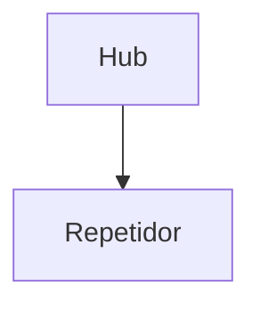
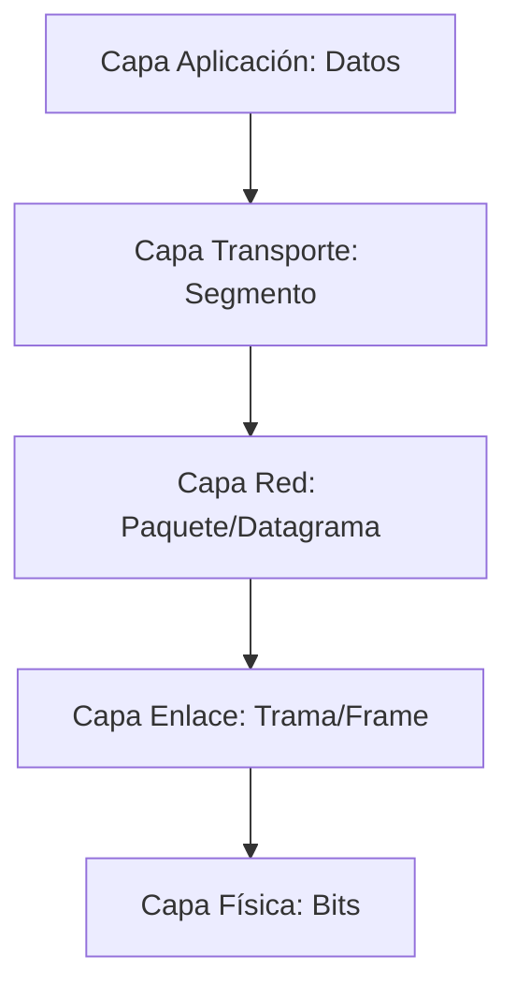
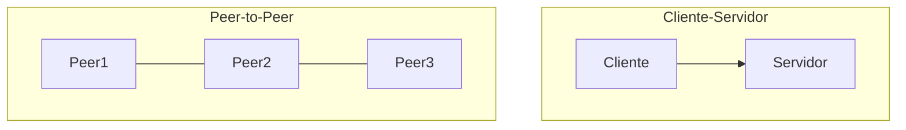

# Infraestructura TIC – Clase 2

## 1. Cursos Cisco
- CNA, CNE, etc.
- Cada curso: **70 horas**

---

## 2. Capa Física
**Elementos:** cables, repetidores, almacenamiento, conexiones, espectro electromagnético.  
Todo lo relacionado con la estructura física de la red.  
El espectro electromagnético es **propiedad del Estado**.

> Cualquier elemento físico por sí solo es inerte (sirve de pisapapeles) hasta que actúa dentro de un sistema.  
> Interactúan muchos elementos que normalmente no tenemos en cuenta.

### 2.1 Dispositivos
- **Hub (Concentrador):** distribuye la señal a todos los puertos.
- **Repetidor de señales:** amplifica y extiende la señal.

---

## 3. Señales
- **Analógicas:** forma de onda senoidal (ejemplo: voz humana).
- **Digitales:** forma cuadrada (representa 1 y 0).

**Atenuación:** pérdida de intensidad con la distancia y el tiempo.  
Llega un punto en que la señal se aplana y no se distingue.  
La propagación depende del medio físico (cables, aire, fibra óptica).  
El aire tiene distintos rangos de frecuencia para cada tipo de señal.

### 3.1 Conversión y muestreo
- **Teorema del Muestreo:** pasar de señal analógica a digital (lectura obligatoria).

**Ejemplo histórico:**
- Hace 49 años: velocidad máxima ≈ **3200 kbps**.
- Hoy: hasta **5 GHz**.

La mejora viene del tratamiento de señales y técnicas de modulación.

---

## 4. Modulación
**Definición:** colocar una señal sobre una portadora (onda continua) para transmitirla por un medio físico.  
**Padres de las señales:** *Fourier* y *Laplace*.

**Tipos:**
- **AM (Amplitud Modulada):** cambia la intensidad. Calidad baja, llega más lejos.
- **FM (Frecuencia Modulada):** cambia la frecuencia. Mejor calidad, menor alcance.
- **PM (Modulación en Fase):** cambia el ángulo de la señal.
- **QAM (Quadrature Amplitude Modulation):** combina amplitud y fase. Representa datos como puntos en un diagrama de constelación.

**Ventaja:** transmitir más información en menos tiempo.  
Ejemplo: pasar de **1 kb/s** a **1 Mb/s** gracias a modulación.

## 5. Cables y Medios de Transmisión
### Par trenzado
- Cable de cobre usado en redes.
- Versiones: Cat3, Cat5, Cat5e, Cat6, Cat7.
- Mayor número de trenzados = menor interferencia y mayor calidad.

**Tipos:**
- **UTP:** no blindado.
- **STP:** blindado.

Ejemplo: teléfonos antiguos de casa → Cat3.  
**Interferencias:** mezcla de señales por cercanía.

### Cable coaxial
- Usado en primeras redes (voz, datos).

---

## 6. Equipos DTE y DCE
### DTE (*Data Terminal Equipment*)
- Genera/procesa datos.
- Ejemplos: computadores, routers, impresoras, servidores.

### DCE (*Data Circuit-terminating Equipment*)
- Conecta el DTE a la red.
- Ejemplos: módems, switches, hubs, multiplexores.

**Regla de conexión:**
- Dos dispositivos iguales → **cable cruzado**.
- Dispositivos diferentes → **cable directo**.

## 7. Módems
**Función:** modular y demodular señales.  

**Ejemplo:**  
En una oficina, la señal eléctrica se transforma en luz para fibra óptica.

---

## 8. Capa de Enlace de Datos (OSI Capa 2)
**Función:** encapsulamiento y desencapsulamiento de datos.

**Proceso:**
1. **Capa de aplicación** genera datos.  
2. **Capa de transporte** agrega cabecera → **segmento**.  
3. **Capa de red** agrega cabecera → **paquete/datagrama**.  
4. **Capa de enlace** agrega cabecera y cola → **trama/frame**.  
5. **Capa física** convierte en bits y transmite.

**PDU (Protocol Data Unit):**
- Aplicación → **Datos**  
- Transporte → **Segmento**  
- Red → **Paquete**  
- Enlace → **Trama**  
- Física → **Bits**

---

### 8.1 Protocolos
Conjunto de reglas para comunicación.  

**Ejemplos:** Ethernet, etc.  
Todo protocolo tiene **sintaxis**, **semántica** y **temporización**.  
Deben ser iguales en ambos extremos para que haya comunicación.

## 9. Dispositivos de Capa 2
- Switches  
- Bridges  
- Transceivers  

**Funciones:** verificación y corrección de errores.

---

## 10. Cliente-Servidor y P2P
**Cliente:** solicita información.  
**Servidor:** entrega información.  

**Peer-to-Peer:**
- Conexión directa entre dos dispositivos.
- **Ventajas:** simple, barata, fácil de configurar.
- **Desventajas:** insegura, no escalable, bajo rendimiento.
  

---

## 11. Tipos de Redes
- **LAN (Local Area Network):** red local.  
- **WAN (Wide Area Network):** red de gran alcance.  

> Ambas funcionan principalmente en **capa 2**.
