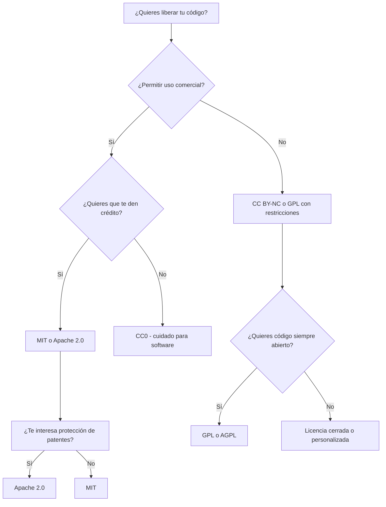

# Licencias de Software Populares

Este documento explica brevemente las licencias de software más utilizadas en el mundo open source, sus características clave y cuándo conviene usarlas.

---

## Licencias Permisivas

###  MIT License
- **Permite:** uso, modificación, distribución y comercialización.
- **Requiere:** atribución al autor original.
- **Incluye:** descargo de responsabilidad.
- **Ideal para:** proyectos personales, librerías, APIs.
- **Compatibilidad:** alta.

###  Apache License 2.0
- Igual que MIT, pero:
- **Incluye:** cláusulas específicas sobre patentes.
- **Ideal para:** proyectos colaborativos o empresariales.

###  BSD 2-Clause / 3-Clause
- Muy parecida a MIT.
- **3-Clause** añade una restricción contra el uso de nombres del autor para promoción.

---

##  Licencias Copyleft (Protección recíproca)

###  GPL v3 (GNU General Public License)
- **Permite:** uso, modificación, distribución.
- **Requiere:** que todo software derivado también use GPL (copyleft fuerte).
- **Ideal para:** proyectos que quieren mantener el código libre siempre.

###  LGPL v3 (Lesser GPL)
- Como GPL, pero más flexible con librerías.
- Permite enlazar con software propietario sin obligar a liberar todo.

###  AGPL v3
- Igual que GPL, pero también exige liberar código en **servicios web**.
- **Ideal para:** apps web que no quieren ser explotadas por terceros cerrados.

---

##  Licencias de Dominio Público

###  CC0 1.0 (Creative Commons Zero)
- **Permite todo:** sin necesidad de atribución.
- **No tiene:** descargo de responsabilidad legal.
- **No es recomendada** para software complejo.
- **Ideal para:** wikis, snippets, ejemplos didácticos.

###  Unlicense
- Similar a CC0, pero con redacción orientada a software.
- **No ampliamente usada.**

---

##  Otras

###  MPL 2.0 (Mozilla Public License)
- Copyleft débil.
- Solo obliga a liberar el código modificado, no todo el software.
- **Ideal para:** mantener núcleos abiertos en apps cerradas.

---

##  Recomendaciones generales

| Situación                          | Licencia recomendada |
|-----------------------------------|-----------------------|
| Proyecto personal/librería        | MIT / Apache 2.0      |
| Proyecto libre recíproco (copyleft)| GPL v3                |
| Servicio web libre total          | AGPL                  |
| Snippets o código educativo       | CC0                   |
| Quiero control total sin obligaciones | Licencia privativa  |

---

##  Referencias

- [Open Source Initiative (OSI)](https://opensource.org/licenses/)
- [Choose a License](https://choosealicense.com/)
- [GNU Licenses](https://www.gnu.org/licenses/)
- [Creative Commons](https://creativecommons.org/licenses/)

---
## 🧭 Árbol de decisión (Mermaid)

> Este documento es informativo y no constituye asesoría legal.
