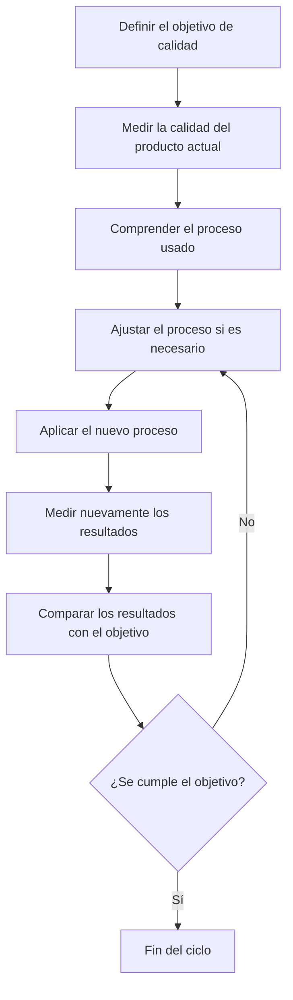

# Apuntes de Clase – Patrones / PSP  
**Primer día de clase**  
**Tema central:** Procesos personales de software, calidad y gestión del tiempo  

---

## Modelo de calidad del SEI (Software Engineering Institute)

El SEI propone un modelo en forma de pirámide con tres niveles de madurez, diseñado para mejorar la calidad del software desde el nivel individual hasta el organizacional:

1. **PSP (Personal Software Process)**  
   - Nivel individual  
   - Mejora la calidad y productividad personal del desarrollador  
   - Introduce disciplina, medición y control  

2. **TSP (Team Software Process)**  
   - Nivel de equipo  
   - Mejora la coordinación, planeación y entrega de resultados  

3. **CMMI (Capability Maturity Model Integration)**  
   - Nivel organizacional  
   - Evalúa y mejora procesos de desarrollo a gran escala  
   - Muy pocas empresas en Colombia están certificadas  
   - En China, más de 800 empresas tienen certificación CMMI  

---

## ¿Qué es la Ingeniería de Software?

Es la disciplina que se enfoca en diseñar, desarrollar y mantener software de calidad, cumpliendo con:

- Cronogramas establecidos
- Presupuestos definidos
- Altos estándares técnicos

---

## Rol del Ingeniero de Software

Para lograr calidad en el desarrollo de software, el ingeniero debe:

- Planificar su trabajo  
- Ejecutar conforme al plan  
- Esforzarse por entregar productos de alta calidad

---

## ¿Cómo mejorar la calidad del software?

Proceso cíclico basado en medición, ajuste y mejora continua:

## Gestión del tiempo – Bitácora PSP

Uno de los pilares del PSP es el control y optimización del tiempo personal.

### ¿Para qué sirve?

- Identificar en qué se gasta el tiempo  
- Detectar tareas repetitivas  
- Optimizar el flujo de trabajo  
- Evaluar precisión en estimaciones  
- Fundamentar mejoras personales con datos reales  

---

## Bitácora de Actividades (Ejemplo PSP)

| Fecha     | Inicio | Fin   | Duración (min) | Actividad               | Categoría     | Interrupciones | Observaciones                        |
|-----------|--------|-------|----------------|--------------------------|----------------|----------------|--------------------------------------|
| 09/03/25  | 08:00  | 09:10 | 70             | Ejercicios de IP         | Programación   | No             | Avancé en 3 ejercicios               |
| 09/03/25  | 10:00  | 10:30 | 30             | Llamadas telefónicas     | Personal       | Sí (2 min)     | Llamada familiar                     |
| 10/03/25  | 14:00  | 15:30 | 90             | Revisión de código       | Calidad        | No             | Encontré 2 errores                   |
| 11/03/25  | 08:30  | 09:00 | 30             | Planificación semanal    | Planeación     | No             | Anoté tareas recurrentes            |
| 11/03/25  | 16:00  | 16:45 | 45             | Documentación del proyecto | Administración | Sí (5 min)     | Me interrumpieron por una reunión   |

---

## Categorías sugeridas para clasificar actividades

- Programación  
- Pruebas  
- Revisión de código  
- Planeación  
- Documentación  
- Estudio / aprendizaje  
- Reuniones  
- Personal  
- Interrupciones  

---

## Buenas prácticas del PSP para la bitácora

- Registrar inmediatamente después de cada tarea  
- Estimar previamente, y luego anotar el tiempo real  
- No subestimar tareas personales (también consumen tiempo)  
- Analizar la bitácora semanalmente para buscar mejoras
