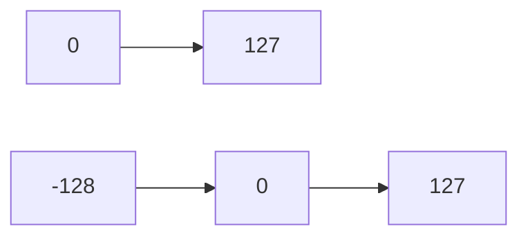
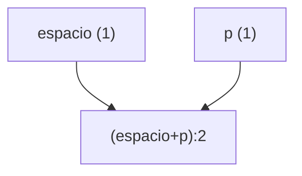
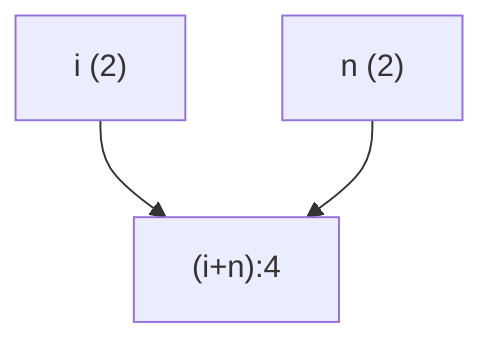
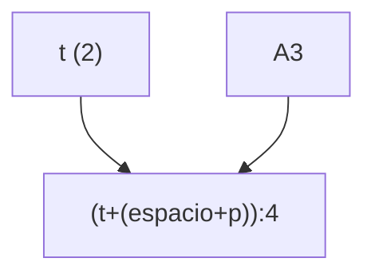
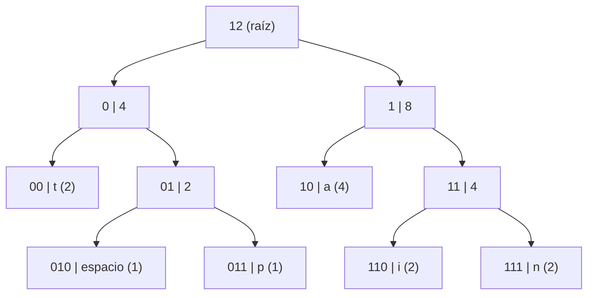

# Clase Análisis de Datos — 14/11/2025

## Conceptos básicos

- **Tiempo:** ejecución del código en el menor tiempo posible.  
- **Espacio:** recursos usados por el código.

---

## Ejemplo de archivo

Crear un archivo llamado `anita.txt` con el contenido “anita patina”.

- Cada símbolo = **1 byte**.  
- El archivo pesa **12 bytes**.  
- 1 byte = **8 bits** → peso total = **96 bits**.  
- **1 KB = 1024 símbolos**.

---

## Tabla ASCII

ASCII = *Código Estándar Americano para Intercambio de Información*.

- Tiene **256 símbolos posibles**.
- Los códigos van del **0 al 255**.

### Rango con signo

Usando 8 bits:

- Valores entre **0 y 127** (sin signo).  
- Con signo, el bit más significativo indica el signo:
  - Rango: **–128 … 0 … 127**

### Byte sin signo

El bit más significativo no se usa para signo, sino como información.

- Con 8 bits sin signo: **0 a 255**

---

## Todo en el disco duro

Todo lo almacenado en el disco duro está en bytes; por lo tanto, son símbolos entre **0 y 255**.

---

##  (rango de valores)




# Algoritmo de Huffman

El algoritmo de **Huffman** surgió a partir de una tesis de doctorado.  
El autor, *David Huffman*, mientras buscaba resolver un problema que no pudo encontrar, terminó descubriendo otra solución inesperada: su algoritmo de compresión.  
A esto se le conoce como **serendipia**.

El **algoritmo de Huffman** se utiliza para **comprimir datos sin pérdida** y es uno de los más importantes en el área de compresión.

---

## Tipos de compresión de datos

Existen dos tipos principales de compresión:

### 1. **Compresión sin pérdida**
- Se comprime el archivo y luego se puede descomprimir **recuperando exactamente los mismos datos**: no se pierde nada.
- El algoritmo de Huffman pertenece a este tipo.

### 2. **Compresión con pérdida**
- Se elimina información durante la compresión.
- Ejemplos:
  - **MP3:** al comprimir audio, se pierden bytes. Para el oído humano puede no notarse, pero en equipos de alta fidelidad sí.
  - **Imágenes JPEG:** cada ciclo de compresión/descompresión va eliminando información progresivamente.

---

## Huffman: dos algoritmos
Huffman consiste realmente en dos fases:

1. **Comprimir**
2. **Descomprimir**

Ambos usan estructuras de datos como listas, árboles binarios y nodos.

---

# Proceso del algoritmo de Huffman

## 1. Crear la tabla de frecuencias
Se cuentan cuántas veces aparece cada símbolo en el archivo.

Ejemplo con “anita patina”:

| Símbolo | Frecuencia |
|---------|------------|
| a       | 4 |
| n       | 2 |
| i       | 2 |
| t       | 2 |
| p       | 1 |
| (espacio) | 1 |

---

## 2. Crear una lista ordenada de símbolos

Se ordenan:
- Primero por frecuencia (de menor a mayor).
- En caso de empate, por valor **ASCII**.

Ejemplo:

| Símbolo | Frecuencia | ASCII |
|---------|------------|-------|
| espacio | 1 | 32 |
| p       | 1 | 112 |
| i       | 2 | 105 |
| n       | 2 | 110 |
| t       | 2 | 116 |
| a       | 4 | 97 |

Lista ordenada (por frecuencia y luego ASCII):


(espacio):1, p:1, i:2, n:2, t:2, a:4

Esto garantiza que todas las personas obtengan el mismo árbol.

---

## 3. Construir el árbol binario

### Primer paso
Tomamos los dos primeros elementos:

espacio (1) + p (1) = 2

Árbol parcial:

  2
espacio   p

Nueva lista:

i:2, n:2, t:2, (espacio+p):2, a:4

---

### Segunda iteración
Tomamos los siguientes dos:

i (2) + n (2) = 4

Árbol:

  4
i    n

Lista:

t:2, (espacio+p):2, a:4, (i+n):4

---
# Construcción del Árbol de Huffman para “anita patina”

## 1. Primer paso
Tomamos los dos primeros elementos:

```
espacio (1) + p (1) = 2
```

Árbol parcial:



Nueva lista:
```
i:2, n:2, t:2, (espacio+p):2, a:4
```

---

## 2. Segunda iteración
Tomamos los siguientes dos:

```
i (2) + n (2) = 4
```

Árbol:



Lista:
```
t:2, (espacio+p):2, a:4, (i+n):4
```

---

## 3. Tercera iteración
Tomamos t:2 y (espacio+p):2:



Lista:
```
a:4, (i+n):4, (t + espacio+p):4
```

---

 ## 4. Crear los códigos de Hoffman

Todo lo que está en la rama izquierda se marca con 0 y todo lo que está en la rama derecha se marca con 1.  
En este caso es un árbol binario completo.  
Un árbol tiene terminales o no terminales, y los nodos tienen máximo dos hijos.  
Los nodos que contienen frecuencia tienen dos hijos.

Los códigos generados son:

- t → `00`
- blanco → `010`
- p → `011`
- i → `110`
- n → `111`
- a → `10`

# Conversión de código Huffman a bits

Supongamos que tenemos este **árbol de Huffman**:

| Símbolo | Código Huffman |
|---------|----------------|
| A       | 0              |
| B       | 101            |
| C       | 100            |
| D       | 111            |
| E       | 110            |

---

<details>
  <summary>Pasos para convertir texto a bits</summary>

## Pasos para convertir texto a bits

### 1. Tomar el texto a codificar  
Ejemplo: `ABCADE`

---

### 2. Reemplazar cada símbolo por su código Huffman  

```
A -> 0
B -> 101
C -> 100
A -> 0
D -> 111
E -> 110
```

---

### 3. Unir todos los códigos en una secuencia de bits  

```
Texto: ABCADE
Bits: 0 101 100 0 111 110
Secuencia final: 01011000111110
```

 **Resultado:** `01011000111110`

</details>

    

## 5. Se multiplica el código de Huffman por el número de bits que ocupa cada símbolo.

| Símbolo | Código de Huffman | Bits |
|---------|--------------------|------|
| a       | 10                 | 8 |
| n       | 111                | 6 |
| i       | 110                | 6 |
| t       | 00                 | 4 |
| blanco  | 010                | 3 |
| p       | 011                | 3 |

De 96 bits se redujo a 30 bits.

El factor de compresión es:

30 / 8 = 3 bytes  
30 % 8 = 6 bits

Es decir, el archivo nuevo tiene **3 bytes y 6 bits**.  
Aproximamos a **4 bytes**.

Tenemos un **33% de compresión**.  
El archivo se comprimió en un **67%**.

# Estructura

**NF** | **Tree** | **BS** | **ZIP**
--- | --- | --- | ---
5 | 6 | 190 36 227 120

---

Tenemos que identificar la basura de la aproximación:  

- `0` → todo el byte  
- `1` → bit  
- …  

**Ejemplo:** En el pasado fue 3 bytes con 6 bits. Vamos a identificar que tenemos 2 bits de basura.  

El primer bit tiene un número:  
- **BS** (Módulo, en el pasado nos dio 6)  
- **NF**: número de nodos frecuencia. En este caso tenemos 5.  

NF ARBOL BS ZIP
5 6


6. Generar el ZIP:  

a n i t a p a t i n a


Pasamos a decimal cada byte:

| Binario       | Decimal | Nota                       |
|---------------|--------|----------------------------|
| 10111110      | 190    |                            |
| 00100100      | 36     |                            |
| 11100011      | 227    |                            |
| 01111000      | 120    | Los últimos 2 bits son basura |

**ZIP resultante:**  
190 36 227 120


---

**Resumen:**

| NF | Tree | BS | ZIP             |
|----|------|----|----------------|
| 5  | (Todavia nada)   | 6  | 190 36 227 120 |


# 7. Recorrido de Árboles y Transformación Huffman

Existen **4 formas de recorrer un árbol**:

- **Preorden**
- **Inorden**
- **Postorden**
- **Recorrido por niveles**

---

## Guardar el árbol en alguna forma de recorrido

### 7. Generar árbol Huffman en preorden
```
12 4 t 2 v p 8 a 4 a n
```

---

## Pasamos a ASCII
```
12 4 116  2 32 112 8 97  4 105 110
```

Aquí podemos confundir las **frecuencias** con los valores ASCII.

Las frecuencias son:
```
12 4 8 4 2 4
```

Los caracteres en ASCII:
```
116 32 112 97 105 110
```

---

## Propuesta para diferenciar nodos frecuencia

Todo lo que sea **-1** es nodo frecuencia. Lo que sea normal es carácter.

Ejemplo:
```
-1 -1 116  -1 32 112 -1 97  -1 105 110
```

---

## Transformada final

Regla:
- Todo lo que sea **-1** lo ponemos como `00`.
- Todo lo que sea un número lo ponemos como `1` seguido del número.

Resultado:
```
00 00 1116 00 132 1112 00 197 00 1105 1110
```


